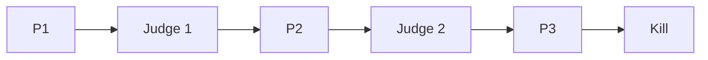
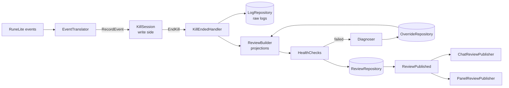
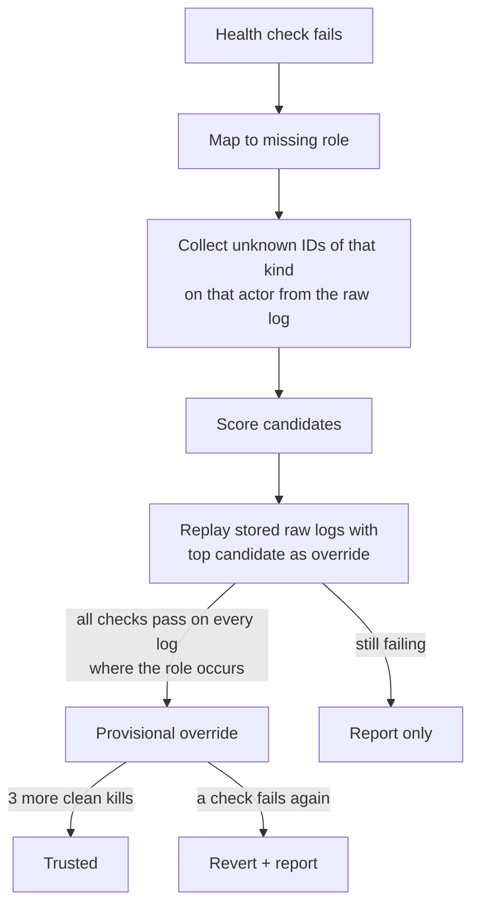

# Yama Reviewer: design spec

2026-09-24 · Stefan Willems · Status: draft for review

Supersedes `2026-09-24-yama-reviewer-original-spec.md` (kept alongside for reference). Game facts, metrics and outputs are unchanged from that document; this spec adds the architecture, the exact classification rules and the decisions on its open product questions.

## 1. Overview

Yama Reviewer is a RuneLite Plugin Hub plugin that records a Yama kill and reviews it after the kill ends. During the fight it shows, says and changes nothing.

It is for players learning P3 prayers and duo mechanics who want to see what went wrong after each kill, without a live helper.

**Goals**

- After each kill: phase times, damage taken per phase by source, P3 prayer accuracy with mistake types, Shadow Crash dodges, void flares, special attack efficiency and drains, supplies used and their cost, and a death recap.
- Separate history for solo, duo host and duo joiner, so kills are only compared like for like.
- A tick log of every P3 attack, so the attack loop can be confirmed from real kills.
- Keep working after game updates renumber IDs, through after-kill self-healing that only ever changes local classification data.

**Not in scope for v1**

- Any overlay, sound, notification, timer or prayer hint during the fight.
- Judging movement methods (Donofly, Godfly).
- Weapon charges in supply cost, loot value and profit per kill.
- Fetching ID updates from a server.
- Sharing reviews with a duo partner via RuneLite Party.

## 2. Rules and compliance

The plugin is only approvable if it stays silent until the kill is over.

- Jagex's [third-party client guidelines](https://secure.runescape.com/m=news/third-party-client-guidelines?oldschool=1) prohibit boss-fight features such as indicating which prayer to use.
- A RuneLite reviewer [stated](https://github.com/runelite/plugin-hub/pull/9520) that visual or audio cues can't be added to PvM encounters.
- After-kill summaries are accepted: [Yama Utilities](https://github.com/sreilly64/yama-utilities) prints damage contribution when Yama dies.

**Design rules**

1. During a fight the plugin only records raw observations. It classifies nothing (no "magic attack", no "wrong prayer") until the kill has ended.
2. Nothing is drawn, printed or played until the kill ends (Yama dies, you die, or you leave). The panel does not refresh during a fight.
3. No sounds or notifications at any point.
4. The metronome tip is text shown after a kill. The plugin never starts, resets or aligns a metronome.
5. The plugin only records inside Yama's Domain (region 6045). Self-healing only changes how finished kills are classified.
6. No network calls. The "Report a problem" button opens the user's browser; nothing is sent automatically.

Rules 1–3 are enforced by the architecture (section 4.4), not only by convention.

## 3. Encounter model

The fight runs P1, Judge, P2, Judge, P3. The Judge intermissions start around 66.6% and 33.3% of Yama's health. Source: [OSRS Wiki, Yama/Strategies](https://oldschool.runescape.wiki/w/Yama/Strategies) and [Yama](https://oldschool.runescape.wiki/w/Yama).



**P3 facts the review relies on**

- Yama stays in the centre and attacks every 7 ticks (down from 8).
- He alternates ranged and magic on every standard attack.
- His first P3 attack matches the more common glyph of the previous phase: shadow glyphs mean a ranged opener, fire glyphs a magic opener.
- Magic shows as flames around the player, ranged as shadowy swirls. The prayer must be on before he snaps his fingers.
- With the right prayer, magic and ranged still hit up to 3. His melee, used only when you're adjacent, hits up to 22 and spawns a void flare.
- Shadow Crash is used only when you're out of melee range: three crashes (cardinal, diagonal, cardinal), each up to 20, each belonging to one player.
- He keeps using standard attacks while crashes fall.
- P3 flares spawn at half health (71). Fully charged, they deal 23 to 25.

**Duo facts**

- At the Judge, the instance creator is placed west and the second player east.
- Yama focuses one player but can switch.
- His melee hits everyone within three tiles of his target.
- In P1 and P2, one player on a glyph protects both. Meteor Strike is cancelled if the untargeted player stands on a Glyph of Fire.

## 4. Architecture

### 4.1 Principles

| Principle | How it applies here |
|---|---|
| Event-driven, event-sourcing-lite | RuneLite events are translated into our own domain events and appended to an immutable per-kill event stream (`KillLog`). Every review is a projection of that stream, so any review can be rebuilt by replaying it. |
| CQRS | Write side: commands `StartKill`, `RecordEvent`, `EndKill` handled by `KillSession`, persisted by `LogRepository`. Read side: projections into `KillReview`, `HistoryView`, `MetronomeStats`, persisted by `ReviewRepository` and read only through query objects. The UI never touches the write side. Implemented with plain handler classes and Guice; no bus library and no database. |
| Separation of concerns, hexagonal (ports and adapters) | `domain` has no dependencies. `application` holds use cases and port interfaces. `adapter` holds everything RuneLite-, Swing- or filesystem-specific. |
| Dependency rule | `adapter → application → domain`, never the other way. Enforced by ArchUnit. |
| Open/closed | Each metric is a `Projection`, each check a `HealthCheck`, each weapon a `DrainRule`, each outcome step an `OutcomeRule`. Adding one is adding a class to an ordered list. |
| Anti-corruption layer | `EventTranslator` is the only class that reads RuneLite event types. Nothing past it knows RuneLite exists. |
| Ubiquitous language | Code uses the game's terms: `Phase`, `Attack`, `PrayerOutcome`, `Crash`, `Flare`, `Spec`, `Drain`, `Mode`. |
| Immutability | Events, `KillLog`, `KillReview` and all value objects are immutable (final fields, unmodifiable collections). |
| YAGNI | No generic event store, no projection dependency graph, no charts, no plugin-to-plugin API. |

### 4.2 Packages

Root package `com.yamareviewer`.

```
domain/
  event/        DomainEvent (sealed-style base), Actor, all events of section 5.1
  model/        KillLog, KillHeader, Mode, Phase, Style, PrayerOutcome, value objects
  ids/          IdRegistry, Role, TimingRules
  projection/   Projection<T>, ProjectionContext, ReviewBuilder and one class per projection
  outcome/      OutcomeRule and the five rules of section 6.3
  drain/        DrainModel, DrainRule, one rule per weapon, YamaStats
  review/       KillReview, Section<T>, SectionStatus, ReviewStatus, section result types
  health/       HealthCheck, CheckResult, the eight checks
  diagnosis/    Diagnoser, Candidate, CandidateScorer, RepairLedger (pure logic), Override
  history/      HistoryView, HistoryProjector, MetronomeStats
  text/         ChatLines, ClipboardExport, ReportWriter (pure string formatting)
application/
  command/      StartKill, RecordEvent, EndKill, KillSession
  handler/      KillEndedHandler, ResetOverridesHandler
  query/        LastKillQuery, HistoryQuery, OverridesQuery
  port/         LogRepository, ReviewRepository, OverrideRepository, ReportRepository,
                PriceSource, ReviewPublisher, Clock
  event/        ReviewPublished (application event)
adapter/
  runelite/     YamaReviewerPlugin, YamaReviewerConfig, EventTranslator, SnapshotReader,
                ModeSignals, ItemManagerPriceSource, HighAlchPriceSource
  persistence/  GsonLogRepository, GsonReviewRepository, GsonOverrideRepository,
                FileReportRepository, DomainEventTypeAdapter
  ui/           ReviewPanel, tab components, ReviewView/HistoryView renderers
  publish/      ChatReviewPublisher, PanelReviewPublisher
resources/
  com/yamareviewer/ids.json
```

### 4.3 Flow of one kill



1. On the client thread, `YamaReviewerPlugin` receives RuneLite events and passes them to `EventTranslator`, which returns zero or more domain events. Outside region 6045 it returns none (except the entry choice, section 5.3).
2. `KillSession` appends them to the open stream. On `FightEnded` it freezes the stream into a `KillLog` and hands it to `KillEndedHandler`.
3. `KillEndedHandler` runs on RuneLite's injected `ScheduledExecutorService`, off the client thread: save the raw log, build the review, run health checks, run the diagnoser if needed, save the review, then post `ReviewPublished` on RuneLite's `EventBus`.
4. `ChatReviewPublisher` sends chat lines via `ClientThread.invokeLater`. `PanelReviewPublisher` refreshes the panel via `SwingUtilities.invokeLater`.

### 4.4 How the silence rule is enforced

- ArchUnit test: no class in `adapter.runelite`, `application.command` or `domain.event` depends on `adapter.publish`, `adapter.ui` or `ReviewPublished`.
- ArchUnit test: no class in the codebase extends `Overlay`, `InfoBox` or references `Notifier`, `Clip`, or `SoundEffect` APIs.
- `KillEndedHandler` is the only class that posts `ReviewPublished`, and it is only invoked from `KillSession.end()`. A unit test replays a full synthetic kill event by event and asserts `ReviewPublisher` is untouched until `FightEnded`.
- `ReviewPanel` never subscribes to game events; it only redraws from `ReviewPublished` and user clicks.

### 4.5 Threading and failure isolation

- Recording code does constant work per event and never touches disk. The in-memory stream for one kill is bounded (a 10-minute kill is roughly 1,000 ticks; each tick produces a handful of events).
- Everything from step 3 runs on the executor. An exception in any projection is caught by `ReviewBuilder`, that section becomes `HIDDEN` with reason `ERROR`, the review becomes `INCOMPLETE`, and the exception is logged. No exception from this plugin propagates to the client.

## 5. Write side

### 5.1 Domain events

Every event carries `tick` (int, game tick counter since fight start) and, where relevant, an `Actor`: `SELF`, `PARTNER`, `YAMA`, `JUDGE`, `FLARE(npcIndex)`, `GLYPH(npcIndex)`, `OTHER(name or npcId)`.

Events record observations with raw IDs. None of them contains a classification.

| Event | Fields | Source RuneLite event |
|---|---|---|
| `EntryChosen` | `TRAVEL` or `JOIN` | `MenuOptionClicked` on Voice of Yama |
| `FightStarted` | players in arena (names), own world position | `NpcSpawned` of Yama inside region |
| `FightEnded` | `YAMA_DIED`, `PLAYER_DIED`, `LEFT` | `ActorDeath`, region change, logout, plugin shutdown |
| `NpcSpawned` / `NpcDespawned` | actor, npcId, npcIndex | same |
| `OverheadTextObserved` | actor, text | `OverheadTextChanged` |
| `ScriptObserved` | scriptId | `ScriptPreFired` |
| `AnimationObserved` | actor, animationId | `AnimationChanged` |
| `GraphicObserved` | actor, graphicId | `GraphicChanged` / `GraphicsObjectCreated` |
| `ProjectileObserved` | projectileId, target actor, end tick | `ProjectileMoved` (first sighting only) |
| `HitsplatObserved` | target actor, hitsplat type, amount, `mine` | `HitsplatApplied` (`Hitsplat.isMine()`) |
| `TickState` | active prayers, HP, prayer points, spec energy, equipped weapon id, Yama's interacting target, own and partner world positions | `GameTick` |
| `InventoryDelta` | itemId, quantity change | `ItemContainerChanged` (inventory) |
| `SuppliesSnapshot` | `START` or `END`, inventory items, rune pouch runes | `SnapshotReader` at fight start and end |

`TickState` is emitted once per `GameTick`, after all other events of that tick, so projections can treat it as "state at end of tick".

### 5.2 KillLog and storage

- `KillLog` = `KillHeader` + ordered `List<DomainEvent>`.
- `KillHeader`: `killId` (UUID), start and end wall-clock time, plugin version, event schema version (starts at 1), `ids.json` version used at record time, entry choice, platform side at first Judge, partner display name (duo only), capture flag.
- Stored by `GsonLogRepository` as gzipped JSON Lines: line 1 the header, then one event per line, at `<RuneLite dir>/yama-reviewer/raw/<killId>.jsonl.gz`. A `DomainEventTypeAdapter` writes a `"type"` discriminator per event.
- Retention: newest N logs (config `rawLogsKept`, default 20). Older logs are deleted after a new one is written.
- Capture mode (config, off by default) writes an additional uncompressed copy to `yama-reviewer/capture/<killId>.jsonl` and records events for `OTHER` actors that normal mode drops.

### 5.3 Fight lifecycle

- Entering region 6045: the session becomes armed. The `EntryChosen` seen most recently before entry (kept in memory only, outside the region) is attached to the session.
- `FightStarted`: Yama spawns while armed. A `START` supplies snapshot is taken on the same tick.
- `FightEnded`: Yama's `ActorDeath` → `YAMA_DIED`; local player's `ActorDeath` → `PLAYER_DIED`; leaving the region, logging out or the plugin shutting down → `LEFT`. An `END` snapshot is taken on the same tick. For `PLAYER_DIED` the snapshot is taken on the death tick, before items drop.
- A session that never saw `FightStarted` is discarded without a review.

### 5.4 Mode detection

Stored in the header and resolved by `ModeProjection`, first match wins:

| Mode | Rule |
|---|---|
| Config override set | That mode |
| Duo joiner | `EntryChosen = JOIN`, or no entry choice and platform side at first Judge is east |
| Duo host | `EntryChosen = TRAVEL` and 2 players in arena at `FightStarted`, or no entry choice and west side with a partner present |
| Solo | `EntryChosen = TRAVEL` and 1 player in arena, or no entry choice and no partner ever observed |

The partner is the other player present at `FightStarted`. Their display name is stored in the header, locally only. In duo, only attacks aimed at `SELF` count toward the prayer review.

### 5.5 IdRegistry and ids.json

All IDs live in `ids.json`, keyed by `Role`. No class outside `domain.ids` contains a numeric game ID. Example (abridged; the glyph, meteor, stomp, horn and remaining spec roles follow the same shape):

```json
{
  "version": 1,
  "npcs":        { "YAMA": [14176], "JUDGE": [14180], "VOID_FLARE": [14179], "VOICE_OF_YAMA": [14185] },
  "regions":     { "YAMAS_DOMAIN": [6045] },
  "scripts":     { "PHASE_TRANSITION": [948] },
  "overheads":   { "PHASE_TRANSITION": ["Begone", "You bore me.", "Enough."] },
  "animations":  { "YAMA_STANDARD_ATTACK": [], "YAMA_MELEE": [], "YAMA_SNAP": [], "SPEC_ELDER_MAUL": [] },
  "graphics":    { "P3_MAGIC_ON_PLAYER": [], "P3_RANGED_ON_PLAYER": [], "SHADOW_CRASH": [], "FLARE_EXPLOSION": [] },
  "projectiles": { },
  "timing":      { "prayerCheck": "HITSPLAT", "prayerCheckOffset": 0, "crashImpactWindow": 1, "specResultWindow": 6 }
}
```

- Roles whose list is empty are **uncaptured**. Every projection declares the roles it needs; if any is uncaptured, its section is `HIDDEN` with reason `IDS_NOT_CAPTURED`. The plugin therefore ships and works (phases, damage totals, supplies, death recap) before any attack ID is known.
- Where RuneLite's `gameval` constants cover an ID, `ids.json` holds that constant's value and a unit test asserts they are equal, so a RuneLite update that renumbers the constant fails the build.
- `IdRegistry` = built-in `ids.json` with active overrides from `OverrideRepository` layered on top (section 9).
- The full role list is the union of what each projection declares; it covers every item in "To capture" of the original spec.

## 6. Read side: projections and classification

### 6.1 ReviewBuilder

`ReviewBuilder.build(KillLog, IdRegistry, PriceTable) → KillReview` runs this ordered list of projections. Each reads the events and the `ProjectionContext` holding earlier results:

`Phases → Mode → Glyphs → Attacks → Crashes → Flares → Specs → DamageAttribution → Supplies → DeathRecap → TickLog`

Each produces a `Section<T>`: either `OK(value)` or `HIDDEN(reason)` where reason is `IDS_NOT_CAPTURED`, `HEALTH_CHECK_FAILED`, `NOT_APPLICABLE` (for example partner damage in solo) or `ERROR`.

`PriceTable` is built by the handler from the `PriceSource` port before the build, so `ReviewBuilder` stays pure.

### 6.2 Phases

- P1 starts at `FightStarted`.
- Judge N starts at the first of: `ScriptObserved(PHASE_TRANSITION)` or `OverheadTextObserved(YAMA, one of PHASE_TRANSITION)`.
- Judge N ends at `NpcDespawned(JUDGE)`; the next phase starts on the same tick.
- P3 ends at `FightEnded`.
- Result: ordered list of `(Phase, startTick, endTick)` and durations in seconds (tick × 0.6). A fight ended early has only the phases reached.

### 6.3 P3 attacks and prayer outcomes

**Detecting an attack:** `AnimationObserved(YAMA, YAMA_STANDARD_ATTACK)` during P3. Its target is the player who receives `GraphicObserved(P3_MAGIC_ON_PLAYER | P3_RANGED_ON_PLAYER)` within the next 3 ticks; if none, Yama's interacting target from `TickState`.

**Style:** from the graphic (`P3_MAGIC_ON_PLAYER` → magic, `P3_RANGED_ON_PLAYER` → ranged). Behaviour cross-check: if the target had protection for style X active at the landing tick and the hitsplat was ≤ 3, behaviour says X. Both values are kept on the `Attack`; disagreement feeds the health check in section 8.

**Landing tick:** from `timing.prayerCheck`. `HITSPLAT`: tick of the first `HitsplatObserved` on the target after the attack animation, plus `prayerCheckOffset`. `SNAP`: tick of `AnimationObserved(YAMA, YAMA_SNAP)`, plus `prayerCheckOffset`. The default ships as `HITSPLAT` with offset 0 and is corrected in `ids.json` from the logging kills.

**Outcome** (only for attacks targeted at `SELF`): the first matching `OutcomeRule` wins. "Correct prayer" means Protect from Magic for magic, Protect from Missiles for ranged. `L` is the landing tick; prayer state per tick comes from `TickState`.

| # | Rule | Outcome |
|---|---|---|
| 1 | Correct prayer active at `L` | `BLOCKED` |
| 2 | Correct prayer active at any tick in `L-3 … L-1`, not active at `L` | `TOO_EARLY` |
| 3 | Correct prayer active at `L+1` | `LATE` |
| 4 | The other protection prayer active at `L` | `LOST_ALTERNATION` |
| 5 | Otherwise | `NO_PRAYER` |

**Switch timing:** ticks between the previous attack's `L` and the first tick the correct prayer is active for this attack. Not computed for the first attack or when the outcome is `NO_PRAYER`.

**Opener:** the `Glyphs` projection counts shadow and fire glyph spawns in P2 (`NpcSpawned` or `GraphicObserved` for roles `GLYPH_SHADOW` and `GLYPH_FIRE`). Majority shadow → expected opener ranged; majority fire → magic; tie → no expectation. The opener result is the first P3 attack's style, the expectation, and its outcome.

**Tick log:** for every P3 attack (any target), its tick and the gap from the previous attack. Every gap that isn't 7 is annotated with the events between the two attacks that belong to crash, flare-spawn and melee roles.

### 6.4 Shadow Crash

- `GraphicObserved(SHADOW_CRASH)` events are grouped into sets: a new set starts when more than 6 ticks have passed since the previous crash graphic.
- Each crash belongs to the player it appeared on or nearest to (from `TickState` positions).
- A crash is `HIT` if a hitsplat lands on its player within `crashImpactWindow` ticks of the impact tick, and that hitsplat isn't already assigned to a standard attack; the damage is that hitsplat's amount. Otherwise `DODGED`.
- Result: per crash (set index, player, hit or dodged, damage) and totals for `SELF`.

### 6.5 Void flares

- Spawned: `NpcSpawned(VOID_FLARE)`. Waves are spawns within 3 ticks of each other.
- `EXPLODED`: `GraphicObserved(FLARE_EXPLOSION)` on the flare, or a heal-type `HitsplatObserved` on Yama within 1 tick of the flare despawning.
- `KILLED`: despawned without an explosion.
- Result: spawned, killed, exploded, Yama's total healing from explosions, and per wave the ticks from first spawn to last despawn.

### 6.6 Special attacks and drains

**Detection**

- Own spec: spec energy in `TickState` drops between two consecutive ticks, the equipped weapon maps to a `SPEC_*` weapon role, and `AnimationObserved(SELF, that weapon's spec animation)` occurs on the same tick or the tick before.
- Partner spec: `AnimationObserved(PARTNER, any SPEC_* animation)`.
- Result: the first hitsplat on Yama within `specResultWindow` ticks with `mine = true` (own spec) or `mine = false` (partner spec). Amount > 0 → `LANDED`, 0 → `MISSED`, none → `UNKNOWN`.
- Soulflame horn is recorded as an assist on the partner's next maul or warhammer spec, with whether that spec landed.

**DrainModel**

- `YamaStats` starts at Defence 225, Magic 250. Defence never goes below 145 (80-point cap).
- Each landed spec goes through its weapon's `DrainRule`, in tick order, producing Defence and Magic after it.

| Weapon | DrainRule |
|---|---|
| Elder maul | Defence − floor(35% of current Defence) |
| Dragon warhammer | Defence − floor(30% of current Defence) |
| Bandos godsword | Defence − damage dealt |
| Accursed sceptre | Defence − ceil(15% of current Defence), Magic − ceil(15% of current Magic) |
| Emberlight | Defence drain per the wiki formula confirmed before implementation (see 12) |
| Eye of Ayak | Magic-defence drain per the wiki formula confirmed before implementation (see 12) |
| Soulflame horn, purging staff, Saradomin godsword | No drain; recorded only |

Pinned tests, straight from the wiki: one elder maul spec 225 → 147; accursed sceptre Magic 250 → 212 and Defence 225 → 191; three Emberlight specs reach 145. Stat restore over time is ignored in v1.

**Spec efficiency per kill:** landed/used per weapon, total Defence drained out of 80 and the phase the floor was reached in (if reached), spec energy spent per Defence point drained, damage per spec for weapons without a drain rule.

### 6.7 Damage attribution

Every `HitsplatObserved` on `SELF` or `PARTNER` of a damage type gets exactly one source, first match:

1. The landing hitsplat of a standard attack → `STANDARD`
2. Within 2 ticks after `AnimationObserved(YAMA, YAMA_MELEE)` → `MELEE`, or `MELEE_SPLASH` if Yama's target that tick was the other player
3. Assigned to a crash in 6.4 → `SHADOW_CRASH`
4. Within 1 tick of a flare explosion → `FLARE`
5. Within 2 ticks of a P1/P2 special graphic (roles `GLYPH_SPECIAL`, `METEOR_STRIKE`, `SHADOW_STOMP`) → `SPECIAL`
6. Otherwise → `OTHER`

Results are totals per phase per player per source. `MELEE_SPLASH`, unblocked glyph specials, Meteor Strike and flare explosions are also totalled as "shared mechanics". No output assigns a mechanic to a person.

### 6.8 Supplies

- Compare `START` and `END` snapshots (inventory + rune pouch). Only decreases count; items gained are ignored.
- Potions are grouped by base name with their dose suffix removed (`Super restore(4)` → `Super restore`), and counted in doses.
- Price per item from `PriceTable`; price per dose = price of the highest-dose variant ÷ its dose count.
- Result: list of (item, quantity or doses, cost) and total cost.

### 6.9 Death recap

- Only when `FightEnded = PLAYER_DIED`.
- The 10 ticks up to and including the death tick: per tick, hitsplats on `SELF` with their source from 6.7, HP and prayer points, Yama's target, and items consumed (negative `InventoryDelta`).

## 7. Outputs

### 7.1 Publishing

After a review is saved, `KillEndedHandler` posts `ReviewPublished(killId, mode)`. Chat and panel subscribe independently.

### 7.2 Chat summary

Up to four `GAMEMESSAGE` lines via `ChatMessageManager`, each switchable in config. A `HIDDEN` value prints as `n/a`. Example:

- `Yama (duo host) 4:12. P1 1:05, P2 1:10, P3 1:24.`
- `P3 prayers 17/19 blocked (2 too early). Crashes 8/9 dodged.`
- `Flares 5/6 killed. Damage taken 212 (partner 188).`
- `Specs: Def 225→145 in P1 (3/3 Emberlight). Supplies 318k.`

Optional fifth block: the death recap (config, off by default).

### 7.3 Side panel

- Tabs: **Last kill**, **Solo**, **Duo host**, **Duo joiner**.
- **Last kill:** status badge (complete / incomplete / auto-repaired), death recap on top if you died, then phase times, damage by source (you, partner, shared), opener, per-attack prayer timeline, crashes, flares, specs and drains, supplies and cost, P3 tick log, metronome tip. Hidden sections show their reason in one line.
- **Mode tabs:** list of the last N kills (config `historySize`, default 50) with averages, personal bests (fastest kill, best P3 accuracy) and a trend arrow comparing the mean of the last 10 kills with the 10 before, for P3 accuracy, kill time, Defence drained and cost per kill. Selecting a kill shows its full review.
- **Footer:** active overrides with a Reset button, "Report a problem".
- Every review has a **Copy** button.
- The Swing code only renders `ReviewView` / `HistoryView` view models built by the queries; it contains no calculations.

### 7.4 Copy to clipboard

`ClipboardExport` produces plain text: the chat lines, spec efficiency, supplies and cost, and the death recap if any. Pure function of `KillReview`.

### 7.5 Metronome tip

`MetronomeStats` is projected from stored reviews of the current mode. When at least 5 kills have a P3 tick log and at least 90% of all their gaps equal the same value G, the panel shows: "Yama attacked every G ticks in your P3s. RuneLite's Metronome with Tick Count set to G matches that beat." Hidden if config `metronomeTip` is off.

### 7.6 Stored reviews

`GsonReviewRepository` stores full `KillReview`s as JSON in `yama-reviewer/reviews/<mode>/<killId>.json`, keeping the newest `historySize` per mode. `HistoryView` is rebuilt from them on startup and after each publish. Reviews can be rebuilt from raw logs while those logs exist; older reviews keep the values they were built with.

## 8. Health checks

Run after every build. Each `HealthCheck` returns pass/fail and the sections to hide on failure. Failing any check makes the review `INCOMPLETE` unless the diagnoser repairs it.

| Check | Pass condition | Hides |
|---|---|---|
| `PhaseOrder` | For `YAMA_DIED`: all of P1, J1, P2, J2, P3 in order. Otherwise: the phases reached are a prefix of that order | Phase times, tick log |
| `P3AttackCount` | Attack count within ±2 of P3 ticks ÷ 7 | Prayer review, opener, tick log |
| `Alternation` | ≥ 90% of consecutive attacks on the same target alternate style | Prayer review, opener |
| `BlockedDamage` | Every `BLOCKED` attack's hitsplat ≤ 3 | Prayer review |
| `GraphicVsBehaviour` | Graphic style equals behaviour style wherever behaviour gives one | Prayer review, opener |
| `CrashSets` | Every crash set on one player has size 3, except the last set of a fight that ended | Crashes |
| `SpecsMatched` | Every spec-energy drop is matched to a spec animation | Specs and drains |
| `SuppliesSnapshot` | `START` and `END` snapshots exist | Supplies |

Checks are skipped (not failed) for sections already hidden as `IDS_NOT_CAPTURED` or `NOT_APPLICABLE`.

## 9. Self-healing

All of this runs in `KillEndedHandler`, after the kill, on the executor.



- **Role mapping:** each health check names the roles whose IDs it depends on, for example `GraphicVsBehaviour` → `P3_MAGIC_ON_PLAYER`, `P3_RANGED_ON_PLAYER`.
- **Candidates:** IDs in the raw log that aren't in the registry, of the same kind (animation, graphic, projectile) and on the same actor as the role.
- **Scoring:** `CandidateScorer` checks the pattern the role has to follow: for P3 attack graphics, appearance period close to 7 ticks, a consistent lead time before hitsplats on that player, and alternation with the paired role; for crash graphics, sets of 3; for spec animations, same tick as an unmatched spec-energy drop. Highest score wins; ties produce a report without an override.
- **Validation:** `ReviewBuilder` and all health checks re-run on every stored raw log with the candidate applied. The candidate is accepted only if every log that contains it passes.
- **`RepairLedger`** (stored as `yama-reviewer/overrides.json` by `GsonOverrideRepository`): per override, role, id, status `PROVISIONAL` or `TRUSTED`, clean kills since creation, created-at, plugin version. After 3 clean kills a provisional override becomes trusted. A failing check involving an overridden role reverts that override and writes a report.
- **Plugin updates:** when the built-in `ids.json` version is higher than the version an override was created against, and the built-in list for that role is non-empty, the override is dropped. Built-in values win.
- **Labelling:** a review built with any override is `AUTO_REPAIRED`. The panel lists active overrides with Reset (clears all overrides and rebuilds the last kill's review).
- **Reports:** `ReportWriter` produces text with plugin, RuneLite and game versions, failed checks, unknown IDs with counts and tick offsets, candidate scores, the resulting action, and an event excerpt of at most 200 lines around the first failure. Saved to `yama-reviewer/reports/<timestamp>.txt`. The panel offers Copy and "Report a problem", which opens a prefilled GitHub issue URL through `LinkBrowser` containing the summary only (under 6,000 characters) and asks the user to attach the file.
- **Guardrails:** no code is downloaded or changed at runtime; only local ID overrides. Nothing visible or audible happens during a fight.

## 10. Configuration

| Key | Default | Notes |
|---|---|---|
| `chatPhaseLine`, `chatPrayerLine`, `chatFlareLine`, `chatSpecLine` | on | One per chat line |
| `chatDeathRecap` | off | |
| `metronomeTip` | on | |
| `priceSource` | `GRAND_EXCHANGE` | or `HIGH_ALCHEMY` |
| `modeOverride` | `AUTO` | `AUTO`, `SOLO`, `DUO_HOST`, `DUO_JOINER` |
| `historySize` | 50 | per mode |
| `rawLogsKept` | 20 | |
| `autoRepair` | on | Off: failed checks only hide sections and write reports |
| `captureMode` | off | Development only |

## 11. Error handling

- File read errors or corrupt JSON: the file is renamed with a `.corrupt` suffix, skipped and logged; the plugin carries on.
- Write failures: logged; the in-memory review is still published so the user sees the kill.
- Exceptions inside projections, checks or the diagnoser: caught per unit (section 4.5).
- Plugin disabled or client closed mid-fight: the session ends with `LEFT`, and the handler runs if the executor is still alive; otherwise the kill is lost silently.
- An unknown event `type` when reading an older or newer raw log: the event is skipped and the review is marked `INCOMPLETE`.

## 12. Testing

- **Stack:** Gradle from the RuneLite example-plugin template, Java 11 target, JUnit 4 and Mockito as RuneLite uses them, ArchUnit as a test-only dependency.
- **Synthetic streams:** a test DSL, `KillLogBuilder`, builds event streams with made-up IDs and a test `IdRegistry`, for example `at(120).yama().animates(YAMA_STANDARD_ATTACK).graphicOn(SELF, P3_MAGIC_ON_PLAYER).hitsplatOn(SELF, 2)`. Every projection, outcome rule, health check, drain rule and the diagnoser are unit tested this way, so all parts can be built before logging kills.
- **Drain tests:** the pinned wiki numbers of 6.6. Before `EmberlightDrainRule` and `EyeOfAyakDrainRule` are implemented, their formulas are taken from the weapons' wiki pages and written into the tests; the "three Emberlight specs reach 145" test must pass with that formula.
- **Diagnoser tests:** take a synthetic kill, renumber one role's ID in the stream, and assert the diagnoser proposes the new ID, validates it, and that a deliberately wrong candidate is rejected.
- **Silence tests:** section 4.4.
- **Golden tests (after logging kills):** trimmed captured logs in `src/test/resources/fixtures/*.jsonl.gz` with expected review JSON next to them.
- **Replay tool:** a Gradle `replay` task in the test source set that prints the review of a raw log file, used to validate capture files.
- **gameval test:** asserts `ids.json` values equal the RuneLite constants they mirror (section 5.5).

## 13. Delivery

One spec, delivered in four parts that each ship something usable. The implementation plan follows this order.

1. **Foundation and capture:** project setup, domain events, `EventTranslator`, `KillSession`, `LogRepository`, `IdRegistry` with the known IDs, capture mode, silence tests. After this part, the user can do the logging kills.
2. **Review v1 (no attack IDs needed):** phases, mode, flares, damage totals (sources other than `OTHER` appear as IDs are captured), supplies, death recap, `ReviewRepository`, chat, panel, clipboard, history.
3. **P3 and specs:** glyphs, attacks, outcome rules, opener, tick log, crashes, specs, `DrainModel`, metronome tip. Built on synthetic streams; switched on by filling `ids.json` from the logging kills.
4. **Self-healing:** health checks, diagnoser, repair ledger, reports, Reset and "Report a problem".

**Logging kills (done by the user in game, between parts 1 and 3):** four kills with capture mode on: two solo, one as duo host, one as duo joiner. Their output fills `ids.json`, sets `timing.prayerCheck` and becomes the golden fixtures.

**Release gates:**

- Before submitting to the Plugin Hub, describe the after-kill-only design in the RuneLite Discord and confirm per-attack prayer review after the kill is acceptable.
- README with screenshots, the after-kill-only statement and credit to Yama Utilities (BSD-2) for the NPC and region IDs.
- Pull request to `runelite/plugin-hub`.

## 14. Decisions

| Question from the original spec | Decision |
|---|---|
| Weapon charges in supplies | Not in v1 |
| Subtract loot value / profit per kill | Not in v1 |
| Clean kills before an override is trusted | 3, as a constant |
| Opt-in ID update file from GitHub | Not in v1 |
| Sharing reviews through RuneLite Party | Not in v1 |
| Drain model includes stat restore | No, ignored in v1 |
| Plugin name | "Yama Reviewer" (working name) |

**Answered by the logging kills, not by design:** whether the P3 loop is a strict 7 ticks through crashes, flare summons and melee; whether alternation carries across target switches in duo (the `Alternation` check counts per target, so either answer passes); whether the prayer check lands on the snap or the hitsplat (`timing.prayerCheck`); whether crash damage can be told apart by hitsplat timing alone (6.4 uses graphic plus timing either way).
