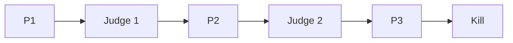
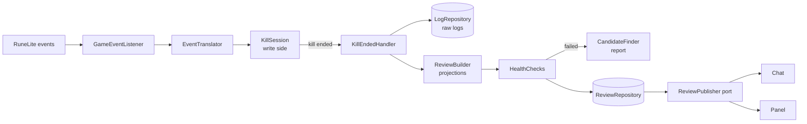

# Yama Reviewer: design spec

2026-09-24 · Stefan Willems · Status: revision 2, after the game-facts, architecture and RuneLite reviews

Supersedes `2026-09-24-yama-reviewer-original-spec.md` (kept alongside for reference). Section 14 lists every decision and every change against that document.

## 1. Overview

Yama Reviewer is a RuneLite plugin that records a Yama kill and reviews it after the kill ends. During the fight it shows, says and changes nothing.

It is for players learning P3 prayers and duo mechanics who want to see what went wrong after each kill, without a live helper.

**Goals**

- After each kill: phase times, damage taken per phase by source, P3 prayer accuracy with mistake types, Shadow Crash and Shadow Wave dodges, void flares, special attack efficiency and drains, supplies used and their cost, and a death recap.
- Contract kills are reviewed with that contract's rules.
- Separate history per mode (solo, duo host, duo joiner) and per contract, so kills are only compared like for like.
- A tick log of every P3 attack, so the attack loop can be confirmed from real kills.
- When a game update breaks recognition, hide the affected numbers instead of showing wrong ones, and write a report with candidate IDs.

**Not in scope for v1**

- Any overlay, sound, notification, timer or prayer hint during the fight.
- Advice on attack timing, such as recommending a metronome setting.
- Automatic ID repair (local overrides, trust and revert). Planned for v1.1 once real reports exist.
- Judging movement methods (Donofly, Godfly).
- Weapon charges in supply cost, loot value and profit per kill.
- Fetching ID updates from a server; sharing reviews through RuneLite Party.

## 2. Rules and compliance

- Jagex's [third-party client guidelines](https://secure.runescape.com/m=news/third-party-client-guidelines?oldschool=1) prohibit boss-fight features such as indicating which prayer to use.
- A RuneLite reviewer [stated](https://github.com/runelite/plugin-hub/pull/9520) that visual or audio cues can't be added to PvM encounters ("if it allows you to index on any element of the encounter whatsoever you cannot do it").
- After-kill tools are accepted: [Yama Utilities](https://github.com/sreilly64/yama-utilities) prints damage contribution when Yama dies; Combat Logger writes fights to disk and has a review panel.
- **Risk:** RuneLite's [Rejected or Rolled Back Features](https://github.com/runelite/runelite/wiki/Rejected-or-Rolled-Back-Features) page lists "Any new high-end PvM boss plugins" as not currently being considered. Decision (section 14): build the plugin now, ask in the RuneLite Discord before submitting to the Plugin Hub, and keep it as a private plugin if they refuse.

**Design rules**

1. During a fight the plugin only records raw observations. It classifies nothing (no "magic attack", no "wrong prayer") until the kill has ended.
2. Nothing is drawn, printed or played until the kill has ended. The panel does not refresh during a fight.
3. No sounds or notifications at any point.
4. No attack-timing advice. The review shows the observed tick gaps; it never predicts attacks or recommends a metronome setting.
5. The plugin only records inside Yama's Domain (region 6045).
6. The plugin makes no network calls. Item prices come from RuneLite's own price data (`ItemManager`). "Report a problem" opens the user's browser; nothing is sent automatically.
7. Player names are stored locally only. Reports and clipboard text never contain them (they say "you" and "partner").

Rules 1–3 are enforced by the architecture (section 4.4), not only by convention.

## 3. Encounter model

Sources: the OSRS Wiki pages [Yama](https://oldschool.runescape.wiki/w/Yama), [Yama/Strategies](https://oldschool.runescape.wiki/w/Yama/Strategies), [Void flare](https://oldschool.runescape.wiki/w/Void_flare), [Judge of Yama](https://oldschool.runescape.wiki/w/Judge_of_Yama) and the weapon pages, read through search-result quotes because the wiki was not reachable from the design environment; and the source code of other Yama plugins (Yama Utilities, ExtraTools, glass combat logger). Everything here is confirmed or corrected by the logging kills (section 13) before release.



**Whole fight**

- Yama has 2,500 HP. The Judges start at 66.6% and 33.3% of his health. Contracts change several of these facts (section 6.3).
- Standard attacks alternate magic and ranged, every 8 ticks in P1 and P2 and every 7 ticks (4.2 seconds) in P3.
- The earliest style cue is a graphic on Yama when he casts: fire means magic, shadow means ranged. The matching impact graphic then appears on his target.
- Stats: Defence 225, Magic 250. Defence can be drained by at most 80 (floor 145). Drained stats restore normally, 1 level per 100 ticks.
- Yama is a demon.

**Mechanics that deal damage**

- **Melee:** only when a player is adjacent; up to 22; hits everyone within three tiles of his target; always summons a void flare.
- **Void flares:** two are summoned intermittently (Yama snaps his fingers), plus one after every melee. If a flare is not killed within about 15 seconds it explodes, damaging players and healing Yama; damage and healing scale with its remaining HP. P1/P2 explosions deal 42–45 unprotected. P3 flares are shadow flares that spawn with 71 HP (half health) and explode for 23–25.
- **P1/P2 specials:** glyph specials (one player on the right glyph protects both), Meteor Strike (cancelled if the untargeted player stands on a Glyph of Fire), Shadow Stomp, fire attacks and Fire Streaks that cross the arena east to west or west to east.
- **Shadow Crash (P3):** only when the target is out of melee range. Three crashes (cardinal, diagonal, cardinal); each crash is a line of three fireballs, and the side fireballs spawn shadows that converge on where the centre fireball landed. Up to 20 per explosion. Every player in the arena gets their own lines. Yama keeps using standard attacks while fireballs fall.
- **Shadow Waves (P3):** cross the arena from the south-east or south-west in sets of 2 or 4; up to 20 damage and they briefly disable protection prayers.
- **Judge phases:** each player fights their own Judge on their own platform; fire surges can hit.

**P3 rotation (for annotating the tick log, not relied on by any check):** Shadow Crash → 2 Shadow Waves → flares → 2 waves → 4 waves with Shadow Crash, with standard attacks throughout.

**P3 prayer facts**

- With the correct protection prayer, P3 magic and ranged still hit up to 3. That number is a prayer-penetration percentage Jagex has changed before, so it is a tunable (`blockedMaxHit`, section 5.5).
- The first P3 attack matches the more common glyph of the previous phase: shadow glyphs mean a ranged opener, fire glyphs a magic opener.

**Duo facts**

- At the Judge, the instance creator is placed west and the second player east.
- Yama focuses one player but can switch. His standard attacks alternate style across the whole fight, not per target.

## 4. Architecture

### 4.1 Principles

| Principle | How it applies here |
|---|---|
| Event-driven, event-sourcing-lite | RuneLite events are translated into the plugin's own domain events and appended to an immutable per-kill event stream (`KillLog`). A review is a projection of that stream, so it can be rebuilt by replaying it. Event types have stable names that never change with class renames. |
| CQRS, kept proportionate | Write side: `KillSession`, whose methods are the commands, appends to the stream; `LogRepository` stores it. Read side: projections turn a stream into a `KillReview`; `ReviewRepository` stores reviews and history is computed from them. That is all CQRS means here: event stream in, review out. No bus, no command classes, no database. |
| Separation of concerns, hexagonal | `domain` has no dependencies. `application` holds the use cases and the ports (interfaces). `adapter` holds everything RuneLite-, Swing- or filesystem-specific. The plugin class is a thin composition root: it builds objects, registers the listener and adds the panel; it handles no game events itself. |
| Dependency rule | `adapter → application → domain`, never the other way. Enforced by ArchUnit (section 4.4). |
| Open/closed | Each metric is a `Projection`, each check a `HealthCheck`, each weapon a `DrainRule`, each outcome step an `OutcomeRule`, each contract a `ContractRules` entry. Adding one means adding a class to an ordered list. |
| Anti-corruption layer | `GameEventListener` and `EventTranslator` in `adapter.recording` are the only classes that see RuneLite game events. |
| Ubiquitous language | The code uses the game's terms: `Phase`, `Attack`, `PrayerOutcome`, `CrashLine`, `Wave`, `Flare`, `Spec`, `Drain`, `Mode`, `Contract`. |
| Immutability | Events, `KillLog`, `KillReview` and all value objects are immutable. The UI only receives immutable view models. |
| YAGNI | No generic event store, no projection dependency graph, no charts, no automatic repair in v1. |

### 4.2 Packages

Root package `com.yamareviewer`.

```
YamaReviewerPlugin, YamaReviewerConfig   composition root and settings
domain/
  event/        DomainEvent, EventType, Actor, value types, the events of section 5.1
  model/        KillLog, KillHeader, Mode, Phase, Style, Contract
  ids/          IdRegistry, Role, RoleKind, Rules
  projection/   Projection<T>, ProjectionContext, ReviewBuilder, one class per projection
  outcome/      OutcomeRule and the rules of section 6.5
  drain/        DrainModel, DrainRule per weapon, YamaStats
  contract/     ContractRules
  review/       KillReview, Section<T>, HiddenReason, ReviewStatus, section result types
  health/       HealthCheck, CheckResult, the checks of section 8
  diagnosis/    CandidateFinder, Candidate
  history/      HistoryKey, HistoryView, HistoryProjector
  text/         ChatLines, ClipboardExport, ReportWriter
application/
  command/      KillSession, SessionState, FightStart, KillEndedListener
  handler/      KillEndedHandler, HistoryLoader
  port/         LogRepository, ReviewRepository, ReportRepository, SnapshotSource, ReviewPublisher
adapter/
  ids/          BuiltInIds (gameval constants)
  recording/    GameEventListener, EventTranslator, ActorResolver, PositionReader, TickSampler, SnapshotReader
  persistence/  FileStore, FilepathFileStore, EventCodec, GsonLogRepository, GsonReviewRepository, FileReportRepository
  publish/      CompositeReviewPublisher, ChatReviewPublisher, PanelReviewPublisher
  ui/           ReviewPanel, tab components, renderers
```

### 4.3 Flow of one kill



1. On the client thread, `GameEventListener` (registered on RuneLite's `EventBus` by the plugin) passes each event to `EventTranslator`, which returns zero or more domain events for `KillSession`. Outside region 6045 nothing is recorded (except the remembered entry choice, section 5.3).
2. When the kill ends, `KillSession` records the final `TickState` on the next game tick, freezes the stream into a `KillLog` and hands it to `KillEndedHandler`.
3. `KillEndedHandler` runs on the plugin's own single-thread executor: save the raw log, build the review, run the health checks, write a report if a check failed, save the review, rebuild the history view, then call the `ReviewPublisher` port if the plugin is still active.
4. `CompositeReviewPublisher` sends the chat lines through `ChatMessageManager.queue` (thread-safe) and hands immutable view models to the panel through `SwingUtilities.invokeLater`.

### 4.4 How the silence rule is enforced

ArchUnit rules (the build fails when one is broken):

- Only `adapter.recording` depends on `net.runelite.api.events` and declares `@Subscribe` methods.
- `adapter.recording`, `application.command` and `domain` never depend on `adapter.publish`, `adapter.ui` or the `ReviewPublisher` port.
- Only `adapter.publish` depends on `ChatMessageManager`. Only `adapter.ui` and the root package depend on Swing, `PluginPanel`, `NavigationButton` or `ClientToolbar`; the root package only constructs and attaches them.
- No class depends on `Overlay`, `InfoBox`, `Notifier`, `javax.sound`, or calls `Client.playSoundEffect`.
- `domain` depends on nothing outside the JDK and Lombok; `application` does not depend on `adapter`, `net.runelite`, Gson or Swing.

A replay test feeds a synthetic fight of RuneLite events through `GameEventListener` with a fake `ReviewPublisher`, and asserts nothing is published before the kill has ended and exactly one review after.

### 4.5 Threading and lifecycle

- **Client thread:** `GameEventListener`, `EventTranslator`, `KillSession`, `TickSampler` and `SnapshotReader`. Item names and both prices (Grand Exchange and high alchemy) are read here, when a supplies snapshot is taken, because `ItemManager` needs the client thread.
- **Plugin executor:** a single-thread executor created in `startUp` and stopped with `shutdownNow()` in `shutDown`, never awaited. All file access runs on it. RuneLite's shared executor is not used, because a slow task there would stall every other plugin.
- **Swing:** `startUp` and `shutDown` run on the Swing thread, so `startUp` only builds objects and submits "load history" to the executor. The panel only receives immutable view models.
- **Lifecycle:** an `active` flag is cleared in `shutDown`; the handler checks it before publishing. Disabling the plugin mid-fight ends the kill as `LEFT` through `ClientThread.invoke`. On `ClientShutdown`, the listener registers the pending raw-log write with `waitFor`, so closing the client right after a kill keeps the log.
- **Failure isolation:** an exception in a projection hides that section with reason `ERROR`; an exception in a check or in the candidate finder is logged and skipped. No exception from this plugin reaches the client.
- **Memory:** one kill's stream is bounded (about 1,000 ticks with a handful of events each).

## 5. Write side

### 5.1 Domain events

Every event carries `tick`: game ticks since the fight started. Events about someone carry an `Actor`: `SELF`, `PARTNER`, `YAMA`, `JUDGE`, `FLARE(npcIndex)`, `NPC(npcId)` for any other NPC that has a role, or `OTHER(name)`. Events about `OTHER` actors are dropped unless capture mode is on.

Events record observations with raw IDs. None of them contains a classification. Each has a stable type name, written into the log.

| Event (type name) | Fields | Source |
|---|---|---|
| `EntryChosen` (`entry`) | `TRAVEL` or `JOIN` | `MenuOptionClicked` on any Voice of Yama NPC |
| `FightStarted` (`fight-start`) | own name, own position | first combat Yama spawn while armed (5.3) |
| `FightEnded` (`fight-end`) | `YAMA_DIED`, `PLAYER_DIED` or `LEFT` | 5.3 |
| `PlayerSeen` / `PlayerLeft` (`player-seen`, `player-left`) | name | `PlayerSpawned` / `PlayerDespawned`, local player excluded |
| `GameStateObserved` (`game-state`) | `LOADING`, `LOGGED_IN`, `HOPPING`, `LOGIN_SCREEN`, `CONNECTION_LOST` | `GameStateChanged` |
| `NpcSpawnObserved` / `NpcDespawnObserved` (`npc-spawn`, `npc-despawn`) | actor, npcId, npcIndex; despawn also `dying` | `NpcSpawned` / `NpcDespawned` (`NpcUtil.isDying`) |
| `NpcChangedObserved` (`npc-changed`) | actor, old id, new id | `NpcChanged` |
| `ObjectSpawnObserved` / `ObjectDespawnObserved` (`object-spawn`, `object-despawn`) | objectId, position | `GameObjectSpawned` / `GameObjectDespawned` |
| `ObjectAnimationObserved` (`object-animation`) | objectId, position, animationId | polled each tick for glyph-role objects (every dynamic object in capture mode); RuneLite has no event for object animations |
| `OverheadTextObserved` (`overhead`) | actor, text | `OverheadTextChanged` |
| `GameMessageObserved` (`game-message`) | text, with colour tags | `ChatMessage` of type `GAMEMESSAGE` (system messages only, never player chat) |
| `VarbitObserved` (`varbit`) | varbitId, value | `VarbitChanged`, only varbits that have a role |
| `WidgetTextObserved` (`widget-text`) | componentId, text | the contract name component when its interface loads (6.3) |
| `AnimationObserved` (`animation`) | actor, animationId | `AnimationChanged` |
| `GraphicObserved` (`graphic`) | actor, graphicId | `GraphicChanged` (each new spot anim on the actor) |
| `GroundGraphicObserved` (`ground-graphic`) | graphicId, position | `GraphicsObjectCreated` |
| `ProjectileObserved` (`projectile`) | projectileId, target actor or none, end tick | `ProjectileMoved` (first sighting only) |
| `HitsplatObserved` (`hitsplat`) | target, kind (`DAMAGE`, `BLOCK`, `HEAL`, `OTHER`), raw type, amount, `mine` | `HitsplatApplied` (`Hitsplat.isMine()`) |
| `TickState` (`tick`) | protection prayers (read from the prayer varbits), HP, prayer points, spec energy and run energy in percent, equipped weapon id, Yama's target, own and partner positions | `GameTick` |
| `InventoryDelta` (`inventory`) | itemId, name, change | `ItemContainerChanged` (inventory) |
| `SuppliesSnapshot` (`supplies`) | `START` or `END`, per item: id, name, quantity, GE price, high-alchemy price | taken by `SnapshotReader` |

- **Tick order:** RuneLite posts `GameTick` after all of a tick's packets have been processed, so `TickState` is the state at the end of the tick and every other event of that tick carries the same tick number. Frame-driven events (`ProjectileMoved`, `GraphicsObjectCreated`) carry the current tick counter.
- **Positions:** every position goes through one `PositionReader`, which converts local points to template world coordinates with `WorldPoint.fromLocalInstance(client, localPoint, plane)`. Positions from different RuneLite APIs are never mixed.
- **Ground graphics, projectiles and objects** are recorded without an ID filter while the fight runs (they all belong to the fight in this arena), so reports can find renumbered IDs.

### 5.2 KillLog and storage

- `KillLog` = `KillHeader` + ordered events. Every observation is an event; nothing is derived at record time.
- `KillHeader`: `killId` (UUID), `startEpochMs`, `endEpochMs`, `pluginVersion`, `schemaVersion`, `idsFingerprint` (a hash of the built-in ID map), `capture`. Times are epoch milliseconds, never `java.time` types.
- **Plugin directory:** all files live under `Plugin.getPluginDirectory()` (`.runelite/plugin-data/yama-reviewer/`), with `@PluginDescriptor(internalName = "yama-reviewer")`, which is also the Plugin Hub name. All file I/O goes through RuneLite's `Filepath`.
- **Raw logs:** gzipped JSON Lines at `raw/<startEpochMs, 13 digits>-<killId>.jsonl.gz`: line 1 the header, then one `{"type": "<type name>", "data": {...}}` per event. The newest `rawLogsKept` (default 20) are kept.
- **Schema policy:** the codec reads logs whose `schemaVersion` equals the current one. Logs of another version are kept on disk but not replayed; their stored reviews stay as they were. The version is raised on any incompatible change; there are no upcasters. The codec normalises missing collections to empty ones.
- **Capture mode** (config, off by default) keeps events about `OTHER` actors and polls every dynamic object, in the same raw log. The development tools read the gzipped logs directly.
- Gson is RuneLite's injected instance, extended with `newBuilder()`; the domain never sees Gson.

### 5.3 Fight lifecycle

- **Armed:** the local player's template region is 6045. The last Travel or Join clicked at the Voice of Yama is remembered in memory until the player leaves the region, and recorded as `EntryChosen` when the fight starts.
- **Fight start:** the first spawn of the combat Yama NPC while armed. `FightStarted`, a `PlayerSeen` for every other player already in the arena, and a `START` supplies snapshot are recorded on that tick. A duo joiner who loads in while Yama is already fighting starts at scene load, so their P1 time runs from their entry.
- **Scene reloads:** a `LOADING` game state while armed does not end the fight. NPC despawns and respawns around it are recorded but ignored by the projections.
- **Fight end:**
  - `YAMA_DIED`: `ActorDeath` of the Yama NPC captured at fight start, or its despawn while `NpcUtil.isDying` is true.
  - `PLAYER_DIED`: `ActorDeath` of the local player.
  - `LEFT`: leaving the region, `LOGIN_SCREEN`, `HOPPING`, or the plugin shutting down.
  - The `END` supplies snapshot is taken as soon as the end is seen (before death drops items), and only while logged in. The end is then completed on the next game tick, after that tick's `TickState`, so the death recap includes the death tick. When no further tick will come (logout, shutdown) it completes immediately.
- **Recording self-check:** if an NPC named "Yama" spawns with an ID the plugin doesn't know while armed, no kill can be recorded, so a report is written (section 9).

### 5.4 Mode detection

Mode is derived by `ModeProjection`, never stored in the header. First match wins:

| Mode | Rule |
|---|---|
| Config override set | That mode |
| Duo joiner | `EntryChosen = JOIN` |
| Duo host | `EntryChosen = TRAVEL` and another player seen before the first Judge ends |
| Solo | `EntryChosen = TRAVEL` and no other player seen |
| No entry choice | Another player seen: your x position at the first Judge greater than theirs (east) → duo joiner, otherwise duo host. Nobody seen → solo |

- The partner is the first other player seen before the first Judge ends. Their name comes from `PlayerSeen` events and is used locally only.
- Mode always resolves, so every review has a history bucket.
- In duo, only attacks aimed at `SELF` count toward the prayer review.

### 5.5 IDs and tunables

- **Built-in IDs:** `adapter.ids.BuiltInIds` builds the `IdRegistry` from RuneLite's `gameval` constants (`NpcID`, `AnimationID`, `SpotanimID`, `ObjectID1`, `ItemID`, `VarbitID`, `InterfaceID`). When RuneLite regenerates those constants after a game update, many renumberings fix themselves. Values with no constant (region 6045, overhead texts) are literals in the same class, and no other class contains a game ID.
- **Uncaptured roles:** a role with no IDs makes every section that needs it `HIDDEN` with reason `IDS_NOT_CAPTURED`.
- **Confirmation:** mappings marked "unconfirmed" below ship as they are and are confirmed or corrected by golden tests built from the logging kills (section 13), before release.
- **Tunables** (`domain.ids.Rules`, with defaults, no game IDs): `prayerCheck` (`CAST` or `HITSPLAT`, default `CAST`), `prayerCheckOffset` 0, `blockedMaxHit` 3, `p1p2AttackCycle` 8 (7 under a contract), `p3AttackCycle` 7, `crashImpactWindow` 1, `crashSetGap` 6, `waveDisableWindow` 5, `specResultWindow` 6, `statRestoreTicks` 100, `minAttackCountRatio` 0.6, `minCycleGapRatio` 0.8, `minAlternationRatio` 0.9.

**Roles**

| Role | Kind | Built-in source | Confidence | Used by |
|---|---|---|---|---|
| `YAMA` | npc | `NpcID.YAMA` | confirmed (Yama Utilities) | everything |
| `JUDGE` | npc | `NpcID.YAMA_JUDGE_OF_YAMA` | confirmed | Phases |
| `VOID_FLARE` | npc | `NpcID.YAMA_VOIDFLARE` | confirmed | Flares |
| `VOICE_OF_YAMA` | npc | `NpcID.VOICE_OF_YAMA_1OP`, `_2OP`, `_3OP` | confirmed | entry choice |
| `METEOR_NPC` | npc | `NpcID.YAMA_METEOR_NPC` | unconfirmed | DamageAttribution |
| `JUDGE_FIRE_SURGE` | npc | none known; to capture | uncaptured | DamageAttribution |
| `YAMAS_DOMAIN` | region | 6045 | confirmed | recording |
| `PHASE_TRANSITION_TEXT` | overhead | "Begone", "You bore me.", "Enough." | unconfirmed | Phases |
| `PHASE_VARBIT` | varbit | `VarbitID.YAMA_TRANSITION_PHASE` | unconfirmed | Phases |
| `PRAYER_DISABLED_MESSAGE` | message | "You've been injured and can't use protection prayers!" | one plugin | Waves, prayer review |
| `GLYPH_CONJURE_MESSAGE` | message | "Yama conjures" (purple text for shadow, orange for fire) | one plugin | Glyphs |
| `CONTRACT_NAME_WIDGET` | widget | `InterfaceID.YamaContractFight.CONTRACT_NAME` | unconfirmed text | Contract |
| `CONTRACT_ITEM_*` | item | one role per contract, `ItemID.YAMA_*_CONTRACT` (table in 6.3.1) | confirmed | Contract |
| `GLYPH_FIRE` / `GLYPH_SHADOW` | object | `ObjectID1.FLOORKIT_SUMMONING03_FULL02` / `_FULL01` | unconfirmed colours | Glyphs |
| `YAMA_STANDARD_ATTACK` | animation | `AnimationID.NPC_YAMA01_MAGIC01` | unconfirmed | Attacks |
| `YAMA_MELEE` | animation | `AnimationID.NPC_YAMA01_MELEE01` | unconfirmed | Attacks, DamageAttribution |
| `YAMA_FLARE_SUMMON` | animation | `AnimationID.NPC_YAMA_SUMMON01` | unconfirmed | Flares |
| `SHADOW_STOMP` | animation | `AnimationID.NPC_YAMA01_STOMP01` | unconfirmed | DamageAttribution |
| `FLARE_EXPLODE` / `FLARE_DEATH` | animation | `AnimationID.NPC_VOIDFLARE_EXPLODE` / `NPC_VOIDFLARE_DEATH` | unconfirmed | Flares |
| `YAMA_CAST_MAGIC` / `YAMA_CAST_RANGED` | graphic | `SpotanimID.VFX_NPC_YAMA_MAGIC_FIRE_SPOTANIM01` / `VFX_NPC_YAMA_MAGIC_SHADOW_SPOTANIM01` | three plugins agree | Attacks |
| `IMPACT_MAGIC` / `IMPACT_RANGED` | graphic | `SpotanimID.VFX_PLAYER_YAMA_MAGIC_FIRE_IMPACT01` / `VFX_PLAYER_YAMA_MAGIC_SHADOW_IMPACT01` | unconfirmed | Attacks |
| `CRASH_IMPACT` | graphic | `SpotanimID.VFX_PLAYER_YAMA_FALLING_ROCK_IMPACT01` | one plugin | Crashes |
| `CRASH_FIREBALL` | graphic | to capture (ground graphics) | uncaptured | Crashes |
| `SHADOW_WAVE` | graphic | `SpotanimID.VFX_SHADOW_WALL_SMALL`, `_01`–`_03` | one plugin | Waves |
| `FIRE_STREAK` | graphic | `SpotanimID.VFX_FIRE_WALL_01`–`_03` | one plugin | DamageAttribution |
| `FIRE_ATTACK` | graphic | `SpotanimID.VFX_YAMA_FLAMING_ROCK_SPOTANIM_01`, `_PROJECTILE_01`, `_IMPACT_01` | one plugin | DamageAttribution |
| `METEOR_STRIKE` | graphic | `SpotanimID.VFX_YAMA_METEOR_SPOTANIM01`, `_PROJECTILE_01`–`_03` | two plugins | DamageAttribution |
| `GLYPH_PROTECTION` | graphic | `SpotanimID.VFX_YAMA_FIRE_IMMUNITY` / `VFX_YAMA_SHADOW_IMMUNITY` | unconfirmed | DamageAttribution |
| `PHASE_TRANSITION_GRAPHIC` | graphic | `SpotanimID.VFX_YAMA_PORTAL_SHADOW_SPOTANIM01` | one plugin | Phases |
| `FLARE_HEAL` | graphic | `SpotanimID.VFX_VOIDFLARE_EXPLODE_YAMA_IMPACT_RED` / `_BLUE` | unconfirmed | Flares |
| `FLARE_HIT` | graphic | `SpotanimID.VFX_VOIDFLARE_HUMAN_IMPACT_RED` / `_BLUE` | unconfirmed | DamageAttribution |
| `SHADOW_POOL` | graphic | to capture (Oathplate and Harmony contracts) | uncaptured | DamageAttribution |
| `SPEC_*` | animation | `HUMAN_WEAPON_EMBERLIGHT_01_SPEC`, `HUMAN_ELDER_MAUL_SPEC`, `DRAGON_WARHAMMER_SA_PLAYER`, `BGS_SPECIAL_PLAYER` + `BGS_SPECIAL_ORNATE_PLAYER`, `HUMAN_SPECIAL_ACCURSED`, `HUMAN_EYE_OF_AYAK_SPECIAL`, `SOULFLAME_HORN_BLOW_01`–`_03` + `_03_NO_FIRE`, `SGS_SPECIAL_PLAYER` + `SGS_SPECIAL_ORNATE_PLAYER`; purging staff to capture | names match | Specs |
| `WEAPON_*` | item | `ItemID.EMBERLIGHT`, `ELDER_MAUL` + `_ORNAMENT`, `DRAGON_WARHAMMER` + `_ORNAMENT`, `BGS` + `BGSG`, `WILD_CAVE_ACCURSED_CHARGED` + `_RECOL`, `EYE_OF_AYAK`, `SOULFLAME_HORN`, `PURGING_STAFF`, `SGS` + `SGSG` | names match | Specs |

Camera-fade script 948, which Yama Utilities uses to hide phase fades, is not a phase signal: it also runs on entering, leaving and dying. `VarbitID.YAMA_IMP_CONTRACT_SIGNED` is not a fight-contract signal either: it tracks Jim the imp's side quest.

Message roles match by prefix after colour tags are removed; overhead roles match exactly.

## 6. Read side: projections and classification

### 6.1 ReviewBuilder

`ReviewBuilder.build(KillLog, IdRegistry, Rules) → KillReview` runs this ordered list of projections. Each reads the events and the `ProjectionContext` holding earlier results:

`Phases → Contract → Mode → Glyphs → Attacks → Opener → Crashes → Waves → Flares → Specs → DamageAttribution → Supplies → DeathRecap → TickLog`

`Glyphs` is intermediate: it feeds `Opener` and is not shown on its own.

- Each projection produces a `Section<T>`: `OK(value)` or `HIDDEN(reason)`. Reasons: `IDS_NOT_CAPTURED`, `NOT_APPLICABLE` (for example partner damage in solo), `CONTRACT` (not meaningful under this contract), `HEALTH_CHECK_FAILED`, `ERROR`.
- **Review status:** `INCOMPLETE` when any section is hidden for `HEALTH_CHECK_FAILED` or `ERROR`, or the log had skipped events; otherwise `COMPLETE`. The other reasons do not make a review incomplete.
- Prices come from the supplies snapshots in the log, so `ReviewBuilder` is pure and a replay prices a kill as it was.

### 6.2 Phases

- P1 starts at `FightStarted`.
- Judge N starts at the earliest of these, counting only while the fight runs and Yama is alive: a change of `PHASE_VARBIT`, a `PHASE_TRANSITION_TEXT` line from Yama, `PHASE_TRANSITION_GRAPHIC` on Yama, or the spawn of the local player's Judge. The logging kills show which signals are reliable; one is enough.
- Judge N ends when the local player's Judge despawns outside a scene reload; the next phase starts on that tick.
- P3 ends at `FightEnded`.
- Result: ordered `(Phase, startTick, endTick)` with durations (tick × 0.6 seconds). A fight that ended early has only the phases reached.

### 6.3 Contracts

Sources: the OSRS Wiki contract item pages and the "Contracts" section of Yama/Strategies, read through a raw-wikitext mirror (snapshot January 2026), and RuneLite's interface definitions.

- A contract is used on Yama at his throne before the challenge and is consumed when the fight starts. One contract per fight. Only the contracts marked duo in 6.3.1 allow a partner.
- **Detection** (`ContractProjection`), first match wins:
  1. `WidgetTextObserved` from `CONTRACT_NAME_WIDGET`, the contract plate shown during the fight, matched against the names in 6.3.1.
  2. A `CONTRACT_ITEM_*` item leaving the inventory (`InventoryDelta`) in the 20 ticks before the fight started or its first 10 ticks. While armed, the recorder remembers contract items in the inventory, so a contract consumed at the challenge is recorded at fight start. Only the player who presented the contract sees this.
  3. Standard attacks every 7 ticks in P1 (the contract cycle): `UNKNOWN_CONTRACT`. The common rules apply; contract-specific sections are hidden with reason `CONTRACT`.
  4. Otherwise `NONE`.
- **Common rules under any contract:** the Judges start at 75% and 50% of Yama's health; Yama's base Defence is 247 and Magic 275, while drains keep the normal-form limits (6.9); P1/P2 standard attacks come every 7 ticks with two between specials; Shadow Waves and Fire Streaks are more frequent and hit harder; the Judge throws two fire bombs every 3 ticks; standard attacks hit up to 53.
- `ContractRules` holds the per-contract values below as data: HP, solo or duo, `blockedMaxHit` (or none when prayer penetration is changed), random attack styles, Shadow Crash in every phase, P3 crash sets, whether consumables have an effect, whether specs always hit, run-energy death, shadow pools.
- **History:** a kill's history key is mode plus contract, so contract kills are compared only with kills under the same contract.

#### 6.3.1 Contract table

| Contract | Item (`ItemID`) | Players | What changes | Review rules |
|---|---|---|---|---|
| Forfeit Breath | `YAMA_BINDING_CONTRACT` | solo | Run energy drains 1% every 4 ticks and by Yama's damage; the player dies at 0% run energy; P1/P2 waves and streaks behave one phase ahead | Run energy appears in the phase summary and the death recap; a death with 0% run energy is labelled "out of run energy" |
| Glyphic Attenuation | `YAMA_SPECIAL_CONTRACT` | solo | HP 2,875; Defence +666 against every style except crush; glyph protection lasts 2–3 ticks; absorbing a glyph costs 3×; bolt effects disabled | Common rules only |
| Sensory Clouding | `YAMA_SPELL_CONTRACT` | solo | Yama always pursues and tries to melee; standard attacks have increased prayer penetration; unprotected flare explosions are lethal; player attack range halved | `blockedMaxHit` none: `BlockedDamage` and `GraphicVsBehaviour` are skipped; prayer outcomes are still scored |
| Divine Severance | `YAMA_HEAVYRANGED_CONTRACT` | solo | Protection prayers switch off 2 ticks after activation; the right prayer fully blocks standard attacks, melee included; void flares (81 HP in P3) spawn all fight; unprotected explosions are lethal | `blockedMaxHit` 0. A correct prayer switched on 3 or more ticks before `L` is already off again and scores `TOO_EARLY`, as the rules of 6.5 already say |
| Bloodied Blows | `YAMA_2H_CONTRACT` | solo | HP 3,000; Wretched Strength raises every hit's minimum by (100 − current HP)% of its max hit, for both sides; 4 flares in P1/P2 and more often in P3; ranged and magic prayer penetration 5% | `blockedMaxHit` none (minimum hits make it unreliable); low HP is expected, so the death recap shows HP without comment |
| Familiar Acquisition | `YAMA_PET_CONTRACT` | duo | More damage through prayers; continuous 81-HP flares; food and potions do not heal or restore prayer; spec energy regenerates twice as fast; player specs always hit; P1/P2 waves and streaks behave one phase ahead; normal loot is still rolled | `blockedMaxHit` none; supplies list food and potions as used with "no effect under this contract"; specs are never `MISSED` |
| Catalyst Acquisition, Worm Acquisition | `YAMA_CATALYST_CONTRACT`, `YAMA_WORM_CONTRACT` | duo | HP and prayer restoration halved; Shadow Crash in every phase (one set after every P1/P2 magic or ranged attack, five sets in P3); 4 flares; more waves and streaks | Crash lines are reviewed in every phase; `CrashSets` expects five sets in P3 |
| Shard Acquisition | `YAMA_SHARD_CONTRACT` | duo | As Catalyst, and Yama's standard attack styles are random; incantations deal more damage | As Catalyst; `Alternation` and the opener are hidden with reason `CONTRACT`; `LOST_ALTERNATION` is reported as "wrong prayer" |
| Oathplate Acquisition, Harmony Acquisition | `YAMA_ARMOUR_CONTRACT`, `YAMA_HORN_CONTRACT` | solo | As Catalyst, and the centre crash fireball leaves a shadow pool that keeps dealing about 12–13 damage | As Catalyst; `SHADOW_POOL` damage source |

Wiki pages disagree on two details (Glyphic glyph protection 2 or 3 ticks, full-HP flares in P3 under Worm); neither affects a review rule.

### 6.4 Attacks

- **Detection:** `AnimationObserved(YAMA, YAMA_STANDARD_ATTACK)` in any phase.
- **Style:** from `YAMA_CAST_MAGIC` or `YAMA_CAST_RANGED` on Yama on the same tick or the tick after; if neither, from `IMPACT_MAGIC` or `IMPACT_RANGED` on a player within 3 ticks.
- **Target:** the player who receives the impact graphic; if none, Yama's target in the `TickState` of the cast tick.
- **Alternation** is global: each attack's expected style is the opposite of the previous attack's style, whoever it targeted.
- **Behaviour evidence** is negative only: if the target had protection for style X at the prayer-check tick and took more than `blockedMaxHit`, the style was not X. It never proves a style.

### 6.5 P3 prayer review

- **Prayer-check tick `L`:** `CAST` (default): the cast tick plus `prayerCheckOffset`. The `TickState` of a tick holds the prayers the server saw for attacks launched in it. `HITSPLAT`: the first hitsplat on the target after the cast, plus the offset. The logging kills settle which is right.
- **Outcome** for each P3 attack aimed at `SELF`, first matching `OutcomeRule` wins ("correct prayer" is Protect from Magic for magic, Protect from Missiles for ranged). Under Shard Acquisition, rule 4 is labelled "wrong prayer":

| # | Rule | Outcome | Counts as a mistake |
|---|---|---|---|
| 0 | Protection prayers were disabled at `L`: a `PRAYER_DISABLED_MESSAGE` arrived within `waveDisableWindow` ticks before `L` and no protection prayer was active since | `PRAYER_DISABLED` | no |
| 1 | Correct prayer active at `L` | `BLOCKED` | no |
| 2 | Correct prayer active at a tick in `L-3 … L-1`, not at `L` | `TOO_EARLY` | yes |
| 3 | Correct prayer active at `L+1` | `LATE` | yes |
| 4 | Any other protection prayer active at `L` (including Protect from Melee) | `LOST_ALTERNATION` | yes |
| 5 | Otherwise | `NO_PRAYER` | yes |

- **Switch timing:** ticks from the previous attack's `L` to the first tick the correct prayer is active for this attack. Not computed for the first attack, `NO_PRAYER` or `PRAYER_DISABLED`.
- **Opener:** `Glyphs` counts `GLYPH_SHADOW` and `GLYPH_FIRE` objects spawned (or animated) in P2. Majority shadow → expected opener ranged; majority fire → magic; tie → no expectation. The opener result is Yama's first P3 attack on anyone (its style against the expectation) and the outcome of your first P3 attack.
- **Tick log:** every P3 attack (any target) with its tick and the gap from the previous one. A gap that isn't a multiple of `p3AttackCycle` is annotated with the crash, wave, flare-summon and melee events in between. The panel shows the share of gaps equal to 7; it gives no advice.

### 6.6 Shadow Crash

- **Lines:** `CRASH_FIREBALL` ground graphics on the same tick form one line (centre plus sides). A line belongs to the player nearest its centre fireball (from `TickState` positions); every player has their own lines.
- **Sets:** three lines within `crashSetGap` ticks form a set. Under the acquisition contracts crash lines also occur in P1 and P2, and P3 has five sets.
- **Result per line:** `HIT` if `CRASH_IMPACT` appears on its player, or a damage hitsplat that isn't a standard attack's lands on them, within `crashImpactWindow` ticks of the line's impact tick (the converging shadows fall inside that window); the damage is summed. Otherwise `DODGED`.
- Result: per line (set, 1–3, player, hit or dodged, damage) and your lines dodged out of total.

### 6.7 Shadow Waves

- A wave is a `SHADOW_WAVE` graphic (ground or on a player). `HIT` when a damage hitsplat lands on a player within `crashImpactWindow` ticks of the wave reaching them.
- When a wave disables your prayers the game says "You've been injured and can't use protection prayers!" (`PRAYER_DISABLED_MESSAGE`); 6.5 rule 0 uses that message.
- Result: waves dodged out of total per player, and damage.

### 6.8 Void flares

- **Spawned:** `NpcSpawnObserved(VOID_FLARE)`, not during a scene reload. Waves are spawns within 3 ticks of each other; each is tagged as summoned (after `YAMA_FLARE_SUMMON`) or melee (after `YAMA_MELEE`).
- **Exploded:** the flare plays `FLARE_EXPLODE`, or `FLARE_HEAL` appears on Yama or a heal hitsplat lands on Yama within 1 tick of the flare despawning.
- **Killed:** the flare plays `FLARE_DEATH` or despawns dying, without an explosion. Kills finished by a purging staff spec are counted separately.
- Result: spawned, killed, exploded, Yama's healing from explosions, and per wave the ticks from first spawn to last despawn.

### 6.9 Special attacks and drains

**Detection**

- **Own spec:** spec energy in `TickState` drops, and the equipped weapon has a `SPEC_*` animation on the same tick or the tick before. A drop with any other weapon is an `OTHER_WEAPON` spec: recorded with its damage, no drain, not checked.
- **Purging staff:** detected by its animation alone, because its energy is refunded when the target dies.
- **Partner spec:** `AnimationObserved(PARTNER, any SPEC_* animation)`.
- **Result:** the first hitsplat on the target within `specResultWindow` ticks with `mine = true` (own spec) or `mine = false` (partner spec). Amount > 0 → `LANDED`, 0 → `MISSED`, none → `UNKNOWN`. The target is Yama, or the flare for a purging staff spec.
- **Soulflame horn:** makes the next melee attack within 10 ticks always hit for players within its radius, the user included. Recorded: who blew it, whether a melee spec followed within 10 ticks, and whether it landed. A horn with no melee spec after it is flagged as unused.
- **Saradomin godsword:** HP and prayer points restored, from the `TickState`s after the hit.

**DrainModel**

- `YamaStats` starts at the fight's base: Defence 225 and Magic 250, or 247 and 275 under a contract. A separate "magic defence bonus drained" starts at 0.
- **Normal-form limits:** drains refer to the normal-form stats (Defence 225, Magic 250) under a contract too. Defence never goes below 145.
- **Restore:** every `statRestoreTicks` ticks after fight start, drained Defence and Magic each restore 1 level towards the fight's base. The review labels these as modelled values.
- Landed specs apply in tick order:

| Weapon | DrainRule |
|---|---|
| Elder maul | Defence − floor(35% of current Defence) |
| Dragon warhammer | Defence − floor(30% of current Defence), only when the hit dealt damage |
| Bandos godsword | Defence − damage dealt |
| Accursed sceptre | If Defence > 191: Defence = max(191, Defence − 34). If Magic > 212: Magic = max(212, Magic − 38). The limits are 15% below the normal-form stats, so it doesn't stack in a normal fight and drains twice under a contract |
| Emberlight | Defence − 34 (15% of normal-form Defence + 1), stacks |
| Eye of Ayak | magic defence bonus drained + damage dealt (not a stat; never restores) |
| Soulflame horn, purging staff, Saradomin godsword | no drain |

Pinned tests from the wiki numbers: one elder maul spec 225 → 147; sceptre Defence 191 and Magic 212, and a second sceptre spec changes nothing; under a contract two sceptre specs take Defence 247 → 213 → 191 and Magic 275 → 237 → 212; Emberlight 225 → 191 → 157 → 145 (floor); a sceptre after three Emberlights leaves Defence at 145; Eye of Ayak adds its damage to the bonus drained; one restore step after 100 ticks.

**Spec efficiency per kill:** landed out of used per weapon; Defence drained out of 80 and the phase the floor was reached in; spec energy per Defence point drained; damage per spec for weapons without a drain; magic defence bonus drained.

### 6.10 Damage attribution

Every damage `HitsplatObserved` on `SELF` or `PARTNER` gets exactly one source, first match:

1. The landing hitsplat of a standard attack → `STANDARD`
2. Within 2 ticks after `YAMA_MELEE` → `MELEE`, or `MELEE_SPLASH` if Yama's target that tick was the other player
3. Part of a crash line (6.6) → `SHADOW_CRASH`
4. Part of a wave hit (6.7) → `SHADOW_WAVE`
5. Within 1 tick of `FLARE_HIT` on the player or of `FLARE_EXPLODE` → `FLARE`
6. Within 2 ticks of `FIRE_STREAK` → `FIRE_STREAK`
7. Within 2 ticks of `METEOR_STRIKE`, `SHADOW_STOMP`, `FIRE_ATTACK` or a glyph special → `SPECIAL`
8. Within 1 tick of `SHADOW_POOL` under the player (Oathplate and Harmony contracts) → `SHADOW_POOL`
9. During a Judge phase → `JUDGE`
10. Otherwise → `OTHER`

Results are totals per phase, per player, per source. `MELEE_SPLASH`, unblocked glyph specials, Meteor Strike and flare explosions are also totalled as shared mechanics. No output assigns a mechanic to a person.

### 6.11 Supplies

- Compare the `START` and `END` snapshots. Only decreases count.
- Potions are grouped by base name without the dose suffix (`Super restore(4)` → `Super restore`) and counted in doses; a dose is priced as the highest-dose variant in the `START` snapshot divided by its doses.
- Prices come from the snapshot, in the configured source (Grand Exchange or high alchemy).
- A `LEFT` kill without an `END` snapshot hides supplies with reason `NOT_APPLICABLE`.
- Under Familiar Acquisition, food and potions are listed with "no effect under this contract".

### 6.12 Death recap

Only when the fight ended with `PLAYER_DIED`: the 10 ticks up to and including the death tick. Per tick: hitsplats on `SELF` with their source, HP and prayer points, run energy under Forfeit Breath, Yama's target, and items consumed (negative `InventoryDelta`).

## 7. Outputs

### 7.1 Publishing

`KillEndedHandler` calls the `ReviewPublisher` port with the immutable `KillReview` and the rebuilt `HistoryView`. `CompositeReviewPublisher` passes them to the chat and panel publishers. Nothing is published if the plugin was stopped in the meantime.

### 7.2 Chat summary

Up to four `GAMEMESSAGE` lines through `ChatMessageManager`, each switchable. A hidden value prints as `n/a`. Example:

- `Yama (solo, Bloodied Blows) 4:12. P1 1:05, P2 1:10, P3 1:24.`
- `P3 prayers 17/19 blocked (2 too early). Crash lines 8/9 dodged. Waves 5/6.`
- `Flares 5/6 killed. Damage taken 212 (partner 188).`
- `Specs: Def 225→145 in P1 (3/3 Emberlight). Supplies 318k.`

An optional fifth block is the death recap (off by default).

### 7.3 Side panel

- **Tabs:** Last kill, Solo, Duo host, Duo joiner. Each mode tab has a contract filter (no contract, or one contract).
- **Last kill:** status badge (complete or incomplete), death recap on top if you died, then phase times, damage by source (you, partner, shared), opener, per-attack prayer timeline, crash lines, waves, flares, specs and drains, supplies and cost, and the P3 tick log. A hidden section shows its reason in one line.
- **Mode tabs:** the last `historySize` kills (default 50) of that mode and contract, with averages, personal bests (fastest kill, best P3 accuracy) and a trend arrow comparing the mean of the last 10 kills with the 10 before, for P3 accuracy, kill time, spec efficiency (Defence drained and landed share) and cost per kill. Selecting a kill shows its full review.
- **Footer:** "Report a problem" (enabled when there is a report).
- Every review has a **Copy** button.
- Swing code only renders view models; it contains no calculations.

### 7.4 Copy to clipboard

`ClipboardExport` produces plain text: the chat lines, spec efficiency, supplies and cost, and the death recap if any. No player names.

### 7.5 Stored reviews

`GsonReviewRepository` stores full `KillReview`s as JSON in `reviews/<mode>/<killId>.json` with a `reviewSchemaVersion`, keeping the newest `historySize` per mode and contract. `HistoryLoader` builds the `HistoryView` on the executor at startup and after each kill. A review with another schema version is rebuilt from its raw log if that log still exists, otherwise skipped.

## 8. Health checks

Run after every build. Each check needs a minimum of evidence before it can fail, names the sections it hides, and names the roles a report should look at.

| Check | Fails when | Hides | Report roles |
|---|---|---|---|
| `PhaseOrder` | For `YAMA_DIED`: not all of P1, J1, P2, J2, P3 in order. Otherwise: the phases reached are not a prefix of that order | phase times, per-phase damage, prayer review, opener, tick log | phase signals, `JUDGE` |
| `P3AttackCount` | fewer attacks than `minAttackCountRatio` × P3 ticks ÷ 7, or fewer than `minCycleGapRatio` of the gaps are multiples of 7 | prayer review, opener, tick log | `YAMA_STANDARD_ATTACK`, `YAMA_CAST_*` |
| `Alternation` | fewer than `minAlternationRatio` of consecutive P3 attacks alternate, both over the global sequence and per target | prayer review, opener | `YAMA_CAST_*`, `IMPACT_*` |
| `BlockedDamage` | more than one `BLOCKED` attack took more than `blockedMaxHit` | prayer review | `IMPACT_*`; prayer-check timing |
| `GraphicVsBehaviour` | at least 3 attacks whose behaviour evidence contradicts their graphic, and at least 25% of attacks with behaviour evidence | prayer review, opener | `YAMA_CAST_*`, `IMPACT_*` |
| `CrashSets` | a set (by time, across players) does not have 3 lines per player, except the last set of a fight that ended | crash lines | `CRASH_*` |
| `SpecsMatched` | a spec-energy drop while a known spec weapon is equipped has no matching animation | specs and drains | `SPEC_*` |
| `SuppliesSnapshot` | `START` or `END` is missing (not checked for `LEFT` kills) | supplies | none |

- Checks are skipped for sections already hidden as `IDS_NOT_CAPTURED`, `NOT_APPLICABLE` or `CONTRACT`.
- Contract kills use their contract's rules (6.3.1): `BlockedDamage` and `GraphicVsBehaviour` are skipped when `blockedMaxHit` is none, `Alternation` is skipped under Shard Acquisition, `P3AttackCount` uses the contract cycle, and `CrashSets` expects five P3 sets under the acquisition contracts.
- A failing check makes the review `INCOMPLETE` and writes a report (section 9).

## 9. Reports (self-healing, report-only in v1)

- **Candidate finding:** for a failed check, `CandidateFinder` lists IDs in this kill's raw log that the registry doesn't know, of the kinds and on the actors of the check's report roles, ranked by how well they fit the role's pattern: a period near 7 ticks and a lead before hitsplats for attack graphics, sets of three for crash graphics, the tick of an unmatched energy drop for spec animations. It changes nothing.
- **Recording self-check:** an unknown NPC named "Yama" while armed (section 5.3) writes a report with the NPC IDs seen.
- **Report file:** plugin, RuneLite and game versions, failed checks with their numbers, candidates with counts and tick offsets, and an excerpt of at most 200 event lines around the first failure. Actors appear as `SELF`, `PARTNER` and `OTHER`, never names. Saved to `reports/<timestamp>.txt` on the executor.
- **"Report a problem"** copies the latest report and opens a prefilled GitHub issue URL through `LinkBrowser`, containing the summary only (under 6,000 characters) and asking the user to attach the file.
- **Fixing:** a plugin update corrects `BuiltInIds`; a RuneLite update that regenerates `gameval` may already fix it.
- **v1.1 (not in this spec):** local overrides with a trust and revert ledger, a Reset button and an "auto-repaired" status, designed from the reports v1 collects.

## 10. Configuration

| Key | Default | Notes |
|---|---|---|
| `chatPhaseLine`, `chatPrayerLine`, `chatFlareLine`, `chatSpecLine` | on | one per chat line |
| `chatDeathRecap` | off | |
| `priceSource` | `GRAND_EXCHANGE` | or `HIGH_ALCHEMY` |
| `modeOverride` | `AUTO` | `AUTO`, `SOLO`, `DUO_HOST`, `DUO_JOINER` |
| `historySize` | 50 | per mode and contract |
| `rawLogsKept` | 20 | |
| `captureMode` | off | development only |

Config group `yamareviewer`.

## 11. Error handling

- A file that can't be read or parsed is renamed with a `.corrupt` suffix, skipped and logged; the plugin carries on.
- Write failures are logged; the review is still published so the user sees the kill.
- Exceptions inside projections, checks or the candidate finder are caught per unit (section 4.5).
- Disabling the plugin mid-fight ends the kill as `LEFT`; closing the client waits for a pending raw-log write.
- Logs of another schema version are not replayed. An unknown event type in a current-version log is skipped and makes the review `INCOMPLETE`.

## 12. Testing

- **Stack:** Gradle from the RuneLite example-plugin template, Java 11 target, JUnit 4.12, Mockito 5, ArchUnit. The Plugin Hub builds with its own `build.gradle` and never compiles tests, so test-only libraries and development tasks are local only.
- **Synthetic streams:** a test DSL, `KillLogBuilder`, builds event streams with made-up IDs and a test `IdRegistry`, for example `at(120).yama().animates(YAMA_STANDARD_ATTACK).graphicOn(YAMA, YAMA_CAST_MAGIC).hitsplatOn(SELF, 2)`. Every projection, outcome rule, contract rule, health check, drain rule and the candidate finder are unit tested this way, so every part can be built before the logging kills.
- **Drain tests:** the pinned numbers of 6.9.
- **Candidate finder tests:** renumber one role's ID in a synthetic kill and assert the new ID ranks first.
- **Silence tests:** section 4.4.
- **Golden tests (after the logging kills):** trimmed captured logs in `src/test/resources/fixtures/` with the expected review JSON next to them. They confirm every "unconfirmed" role mapping in 5.5.
- **Tools:** `captureSummary` (IDs per actor with counts, first and last tick and the most common gap, next to the gameval name of known constants) and `replay` (prints the review of a raw log). Both are Gradle tasks in the test source set.

## 13. Delivery

One spec, four implementation plans, delivered in order:

1. **Foundation and capture:** project setup, domain events, `GameEventListener`, `EventTranslator`, `KillSession`, raw log storage, `BuiltInIds`, capture mode, the ArchUnit rules and the capture tools. After this part the user can do the logging kills.
2. **Review v1:** phases, contract detection, mode, flares, damage attribution, supplies, death recap, review storage, history, chat, panel and copy.
3. **P3 and specs:** attacks, prayer review, opener, tick log, crash lines, waves, specs and drains, and the per-contract rules.
4. **Health checks and reports:** the checks of section 8, the candidate finder, report files and "Report a problem".

**Logging kills (the user, in game, after Part 1):** two solo kills, one as duo host and one as duo joiner, plus at least one kill under a contract (the contract plate text and the consumed item confirm detection). The guide in the Part 1 plan says what to do deliberately in each. Their logs confirm the role mappings and the prayer-check tick, and become the golden fixtures.

**Release gates:**

- Ask in the RuneLite Discord whether an after-kill-only review with per-attack prayer results is acceptable, given the "high-end PvM boss plugins" line. If not, the plugin stays private.
- README with screenshots, the after-kill-only statement, and credit to Yama Utilities (BSD-2) for the NPC and region IDs.
- Pull request to `runelite/plugin-hub` as `yama-reviewer`.

## 14. Decisions

| Question | Decision |
|---|---|
| Plugin Hub risk ("Any new high-end PvM boss plugins") | Build now; ask in Discord before submitting; stay private if refused (user, 2026-09-24) |
| Self-healing in v1 | Report-only; automatic repair in v1.1 (user, 2026-09-24) |
| Contract kills | Modelled fully, with their own history (user, 2026-09-24); rules in 6.3 from the wiki's contract pages |
| Metronome tip | Removed; the tick log shows the observed gap only (user, 2026-09-24) |
| Drain model includes stat restore | Yes, 1 level per 100 ticks; the wiki says Yama restores stats normally (changed after review) |
| Weapon charges in supplies | Not in v1 |
| Subtract loot value / profit per kill | Not in v1 |
| Opt-in ID update file from GitHub | Not in v1 |
| Sharing reviews through RuneLite Party | Not in v1 |
| Plugin name | "Yama Reviewer", Plugin Hub name `yama-reviewer` |

**Changes against the original spec, for the record**

- IDs come from RuneLite's `gameval` constants, not a JSON file.
- Contracts are modelled (they did not exist in the original spec's scope).
- The Judges start at 75% and 50% under a contract.
- P3 flares are part of the rotation, not triggered by health; they spawn with 71 HP.
- Shadow Crash is reviewed per line of three fireballs; Shadow Waves and Fire Streaks are new damage sources, and prayers disabled by a wave are not counted as mistakes.
- `LOST_ALTERNATION` includes Protect from Melee, as in the original; alternation is checked over the whole fight, not per target.
- The Accursed sceptre drain does not stack; Eye of Ayak drains the magic defence bonus, not Magic; Emberlight drains 34 per spec.
- The supplies check needs both snapshots.
- The Discord question moved from before the prayer review to before the Plugin Hub submission.

**Answered by the logging kills:** which phase signals fire; whether glyphs spawn or only animate, and which object is which colour; whether the prayer check is on the cast or the hitsplat; which ground graphics are crash fireballs; whether the P3 loop stays at 7 ticks through crashes, waves, flare summons and melee; the purging staff spec animation and the Judge fire surge NPC.
