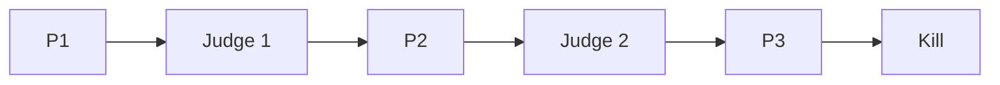
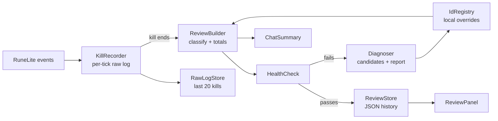
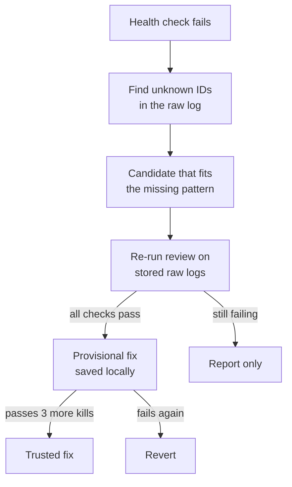

# Yama Reviewer: RuneLite plugin spec

Sep 24, 2026 · @Stefan Willems

## Overview

The Yama Reviewer is a RuneLite Plugin Hub plugin that records a Yama kill and reviews it after the kill ends. During the fight it shows, says and changes nothing.

It's for players who are learning P3 prayers and duo mechanics and want to see what went wrong after each kill, without a live helper.

**Goals**

- After each kill, show phase times, damage taken per phase by source, P3 prayer accuracy with mistake types, Shadow Crash dodges, void flares, special attack efficiency, supplies used and their cost, and a recap if you die.
- Keep separate history for solo, duo host and duo joiner, so kills are only compared like for like.
- Log the tick of every P3 attack, so the attack loop can be confirmed from real kills.

**Not in scope**

- Live overlays, sounds, timers or prayer hints of any kind during the fight.
- Judging movement methods such as the Donofly or Godfly tile paths (possible later).

## Rules and compliance

The plugin is only approvable if it stays silent until the kill is over.

- Jagex's [third-party client guidelines](https://secure.runescape.com/m=news/third-party-client-guidelines?oldschool=1) prohibit boss-fight features such as indicating which prayer to use.
- A RuneLite reviewer [stated](https://github.com/runelite/plugin-hub/pull/9520) that visual or audio cues can't be added to PvM encounters. The only exception is a manually triggered external helper.
- After-kill summaries are already accepted: [Yama Utilities](https://github.com/sreilly64/yama-utilities) prints your damage contribution to chat when Yama is defeated.

**Design rules that follow from this**

1. Recording is invisible. The panel doesn't refresh and no chat line is sent until Yama dies, you die or you leave.
2. No sounds or notifications at any point during the encounter.
3. The metronome tip is text in the panel after a kill. The plugin never starts, resets or aligns a metronome.
4. Before submitting, describe the after-kill-only design in the RuneLite Discord and ask whether per-attack prayer review is acceptable.
5. The plugin only records inside Yama's Domain, and self-healing only changes how finished kills are classified.

## Encounter model

The fight runs P1, Judge, P2, Judge, P3. The Judge intermissions start around 66.6% and 33.3% of Yama's health. Source: [OSRS Wiki, Yama/Strategies](https://oldschool.runescape.wiki/w/Yama/Strategies) and [Yama](https://oldschool.runescape.wiki/w/Yama).

Each arrow is a phase boundary the plugin timestamps.

**P3 facts the review relies on**

- Yama stays in the centre, and his attack speed goes from 8 ticks to 7 (4.2 seconds).
- He alternates ranged and magic on every standard attack.
- His first P3 attack matches the more common glyph from the last phase: shadow glyphs mean a ranged opener, fire glyphs mean a magic opener. That is the opposite of how P1 and P2 open.
- Magic shows as flames around the player, ranged as shadowy swirls. The prayer must be on before he snaps his fingers.
- With the right prayer, magic and ranged still hit up to 3. His melee, used only when you're adjacent, hits up to 22 and spawns a void flare.
- Shadow Crash is used only when you're out of melee range. It comes as three crashes (cardinal, diagonal, cardinal), each hitting up to 20, and each crash belongs to one player only.
- He keeps using standard attacks while the fireballs fall.
- P3 flares spawn at half health (71). If they charge fully, they deal 23 to 25.

**Duo facts**

- At the Judge, the instance creator is always placed west and the second player east.
- Yama focuses one player but can switch to the other.
- His melee hits everyone within three tiles of his target.
- In P1 and P2, only one player needs to stand on a glyph for both to be protected. Meteor Strike is cancelled if the player who isn't targeted stands on a Glyph of Fire.

## Mode detection

The mode comes from how you entered and who is in the arena. It is stored with every kill.

| Mode | Primary signal | Fallback |
| --- | --- | --- |
| Solo | You used Travel at the Voice of Yama, and you are the only player in the arena at fight start | None needed |
| Duo host | You used Travel, and a second player is in the arena | Placed on the west platform at the first Judge |
| Duo joiner | You used Join at the Voice of Yama | Placed on the east platform at the first Judge |

- A config override lets you force a mode if detection gets it wrong.
- In duo, the partner is the other player in the arena. Their display name is saved with the kill, locally only.
- Only attacks aimed at you count toward your prayer review, because in duo Yama isn't attacking you on every beat.

## What gets tracked per kill

Every kill produces one review with the metrics below. They are worked out after the kill from a raw per-tick log.

| Metric | Phases | How it's measured |
| --- | --- | --- |
| Phase times | All | Yama spawning, his phase-transition lines, each Judge despawning, and Yama's death |
| Your damage taken, by source | All | Hitsplats on you, tagged as standard attack, melee, special, Shadow Crash, flare or other |
| Partner's damage taken | All (duo) | Hitsplats on your partner, which your client can see |
| Damage from shared mechanics | P1 to P3 (duo) | Melee splash while Yama targeted your partner, glyph specials nobody blocked, Meteor Strike, flare explosions |
| Opener | P3 | Your prayer when his first P3 attack landed, compared with its style |
| Prayer review | P3 | For each attack aimed at you: its style, your prayer at the hit, the outcome, and how many ticks after the previous hit you switched |
| Shadow Crash | P3 | Each crash dodged or hit, and its damage |
| Void flares | All | Number spawned, killed in time and exploded, Yama's healing from explosions, and time to clear |
| Special attacks | All | Every spec by you or your partner, landed or missed, and the drain it caused (see Special attacks and drains) |
| Supplies and cost | Whole trip | Food, potion doses and runes used, from your inventory and rune pouch at fight start versus fight end, priced at Grand Exchange prices |
| Death recap | On death | The last 10 ticks before you died: each hit and its source, your HP and prayer, Yama's target and what you ate |
| Attack tick log | P3 | The tick of every Yama attack, the gap since the last one, and what happened around any gap that isn't 7 |

**Prayer outcomes (same as the browser trainer)**

- **Blocked:** the right prayer was on when the attack landed.
- **Too early:** the right prayer was on within the 3 ticks before it landed, then switched off.
- **Late:** switched to the right prayer within 1 tick after it landed.
- **Lost the alternation:** the wrong prayer, with none of the above.
- **No prayer:** no protection prayer was on.

Shared-mechanics damage is labelled by source, never as your partner's fault, because the plugin can't know who was meant to handle what.

## Special attacks and drains

Every special attack in the fight is logged, yours and your partner's, and each one gets an efficiency result. Yama's Defence can only be drained by 80 points, from 225 down to 145, so the review shows how close each kill got to that floor. Reference numbers are from [OSRS Wiki, Yama/Strategies](https://oldschool.runescape.wiki/w/Yama/Strategies).

| Weapon | Effect on Yama | Wiki reference | Shown in the review |
| --- | --- | --- | --- |
| Emberlight | Drains Defence, plus Attack and Strength | Three specs take Defence to the 145 floor | Specs landed, Defence after each |
| Elder maul | Drains Defence | One spec takes Defence to 147; needs a partner's soulflame horn to land reliably | Landed or missed, Defence after |
| Dragon warhammer | Drains Defence | Alternative to the maul, also used with the horn | Landed or missed, Defence after |
| Bandos godsword | Drains Defence by damage dealt | Both hits must average at least 40 to reach the floor | Damage, Defence after |
| Accursed sceptre | Drains Defence by 34 and Magic by 38 | Any damage from the spec drains the full amount (Magic 250 to 212) | Landed or missed, Defence and Magic after |
| Eye of Ayak | Drains magic defence | Used together with the sceptre to make Yama easier to hit with magic | Landed or missed, drain |
| Soulflame horn | Helps the partner's maul land | Recorded as an assist | Used, and whether the maul landed after it |
| Purging staff | Used on void flares | Spec on the last hit of a flare | Specs used, flares finished |
| Saradomin godsword | Heals you | Used on the Judge for healing | HP and prayer restored |

**Spec efficiency** for each kill:

- Specs landed out of specs used, per weapon.
- Defence drain reached out of the 80-point cap, and the phase it was reached in.
- Spec energy spent for each Defence point drained.
- Damage dealt per spec for weapons that don't drain, such as claws.

**How it's measured:** a spec is detected from your spec energy dropping, the weapon you have equipped and the spec animation. A partner's spec is detected from their animation. Whether a spec landed comes from the next hitsplat on Yama. Drains are calculated with each weapon's rules and capped at 80. The exact drain formula for each weapon is checked against its wiki page before release.

## Outputs

Each kill produces a short chat summary and a full breakdown in a side panel. Both appear only once the kill has ended.

**Chat summary** (2 to 4 game-message lines, each line can be switched off). Example:

- Yama (duo host) 4:12. P1 1:05, P2 1:10, P3 1:24.
- P3 prayers 17 of 19 blocked (2 too early). Fireballs 8 of 9 dodged.
- Flares 5 of 6 killed. Damage taken 212 (partner 188).
- Specs: Defence 225 to 145 in P1 (3 of 3 Emberlight landed). Supplies used: 318k.

**Side panel tabs**

- **Last kill:** phase times, damage by source for you and your partner, shared-mechanics damage, opener, the per-attack prayer timeline, Shadow Crash results, flares, special attacks and drains, supplies and cost, and the P3 attack tick log. If you died, the death recap is shown at the top. Every review shows its status: complete, incomplete or auto-repaired.
- **Solo, Duo host, Duo joiner:** the last 50 kills of that mode (configurable), with averages, personal bests and a trend for P3 prayer accuracy, kill time, spec efficiency and cost per kill.

**Copy to clipboard**

A Copy button on every review, including past kills in the history tabs, copies a plain-text version ready to paste into Discord. It contains the chat summary lines plus spec efficiency, supplies and cost, and the death recap if there was one.

**Metronome tip**

Once at least 5 logged P3s show a steady gap, the panel shows one line of advice. For example: "Yama attacked every 7 ticks in your P3s. RuneLite's Metronome with Tick Count set to 7 matches that beat." The built-in [Metronome](https://github.com/runelite/runelite/wiki/Metronome) plays a sound on a configurable tick. This tip is advice only and can be hidden in config.

**Config options:** chat summary on or off (per line), death recap in chat on or off, metronome tip on or off, whether supplies are priced at Grand Exchange or high alchemy value, mode override, history size, raw logs kept (default 20), auto-repair on or off, and a capture mode for development (off by default).

## Architecture

The plugin records raw facts during the fight and only classifies them after the kill. That keeps the in-fight code simple, makes classification unit-testable against recorded kills, and means nothing displayable exists until the kill ends.

The arrow labelled "kill ends" is the only point where anything becomes visible.

| Class | Job |
| --- | --- |
| YamaReviewerPlugin | Lifecycle, event subscriptions, and routing events to the tracker and recorder |
| EncounterTracker | Knows whether you're in Yama's Domain, and tracks fight start, fight end and the current phase |
| ModeDetector | Decides solo, duo host or duo joiner |
| KillRecorder | Per-tick log: your prayer, HP and spec energy, hitsplats on both players and Yama, Yama's target and animations, graphics on players, flares, and inventory and rune pouch snapshots |
| RawLogStore | Keeps the raw logs of the last 20 kills on disk, so reviews can be recalculated |
| IdRegistry | Every animation, graphic and projectile ID in one place: built-in values, `gameval` constants where they exist, and local overrides on top |
| ReviewBuilder | Pure Java, no client calls. Turns the log into attacks, outcomes and totals, reading IDs only through IdRegistry |
| HealthCheck | Pure Java. Runs the health checks on a finished review |
| Diagnoser | Pure Java. Finds candidate replacement IDs, tests them on stored logs, and writes the report |
| DrainModel | Pure Java. Each weapon's drain rules, the 80-point cap, and Yama's Defence and Magic after every spec |
| SupplyCounter | Compares the start and end snapshots, counts what was used, and prices it |
| DeathRecap | Keeps the last 10 ticks in a rolling buffer and freezes it when you die |
| KillReview | Immutable data model for one kill, including its status |
| ReviewStore | Saves reviews as JSON (Gson) in the RuneLite folder, split by mode |
| ChatSummary | Builds the after-kill chat lines |
| ClipboardExport | Builds the plain-text review for the Copy button |
| ReviewPanel | Swing side panel, refreshed only when a review is stored |
| YamaReviewerConfig | Settings |

**RuneLite events used:** GameTick, HitsplatApplied, NpcSpawned, NpcDespawned, OverheadTextChanged, AnimationChanged, GraphicChanged, MenuOptionClicked (Travel or Join) and ActorDeath. The exact event for the attack graphics is confirmed during the logging kills.

**Coming from Symfony:** `@Inject` works like autowiring, `@Subscribe` methods work like event subscribers, and the config interface plays the role of bundle configuration.

## Known IDs and what to capture

The NPC and location IDs are already known from Yama Utilities, which is BSD-2 licensed. We reuse them with credit in the README. The attack and graphic IDs still have to be captured in game.

**Known** (from [Yama Utilities](https://github.com/sreilly64/yama-utilities))

| Thing | Value |
| --- | --- |
| Yama NPC | 14176 |
| Judge of Yama NPC | 14180 |
| Void flare NPC | 14179 |
| Voice of Yama NPC | 14185 |
| Yama's Domain region | 6045 |
| Phase transition script | 948 |
| Transition overhead lines | "Begone", "You bore me.", "Enough." |

**To capture**

- The graphic on the player for the P3 magic attack (flames) and ranged attack (swirls).
- Yama's animations for standard attacks, the melee swing and the finger snap.
- Shadow Crash fireball graphics or projectiles, and their impact.
- Void flare explosion, and Yama's heal hitsplat when one explodes.
- P1 and P2 specials: Meteor Strike, Shadow Stomp, and the glyph protection graphic.
- Special attack animations for every weapon in the Special attacks and drains table, on you and on your partner.
- Which tick the prayer check happens on, relative to the snap and the hitsplat.

**Logging kills:** capture mode writes every animation, graphic, projectile, hitsplat, overhead text and prayer change, per tick, to a file. Plan for four kills: two solo, one duo as host and one duo as joiner. Trimmed logs become the test fixtures.

## Reliability and self-healing

After every kill the plugin checks its own results against how the fight is known to behave. When a check fails, it works out what probably changed, tries a fix on the stored raw logs, and always writes a report you can use to fix it properly. All of this runs after the kill, never during it.

**Resilient by design**

- Only record inside Yama's Domain (region 6045). Everywhere else the plugin does nothing.
- Keep the raw logs of the last 20 kills, so any review can be recalculated after a fix.
- Where RuneLite's generated `gameval` constants cover an ID, use the named constant instead of a raw number. RuneLite regenerates those from game data, so a renumbering is often fixed just by updating RuneLite. Yama Utilities already imports them.
- Identify attack styles two ways: from the graphic IDs, and from behaviour. If you had Protect from Magic on and took 3 or less, that attack was magic. If the two methods disagree, something has changed.

**Health checks after every kill**

| Check | Expected | A failure suggests |
| --- | --- | --- |
| Phase order | P1, Judge, P2, Judge, P3, all present | Phase detection changed |
| P3 attack count | Roughly P3 length divided by 7 ticks | Attack animation or graphic IDs changed |
| Alternation | Consecutive P3 attacks alternate style | Magic and ranged IDs swapped or changed |
| Blocked damage | Attacks marked blocked dealt 3 or less | Style detection is wrong |
| Graphic versus behaviour | Both methods give the same style | Graphic IDs changed |
| Shadow Crash | Crashes come in sets of 3 | Fireball IDs changed |
| Specs | Every spec energy drop matches a spec animation | Spec animation IDs changed |
| Supplies | A start snapshot exists | Fight start detection changed |

A review that fails a check is marked "incomplete" and the failing numbers are hidden, instead of showing wrong numbers.

**Repair flow**

It reads top to bottom: a failure only becomes a trusted fix after it has explained the stored kills and held up for three more.

- **Finding candidates.** The plugin looks for IDs it doesn't recognise that appear where the missing one should. For example, a graphic on your character every 7 ticks, a few ticks before each P3 hitsplat.
- **Provisional fixes** go in a local override file, never in the plugin's code. Reviews made with one are labelled "auto-repaired". The panel lists active overrides with a Reset button.
- **Reports** are saved as a text file in the RuneLite folder. Each contains the plugin, RuneLite and game versions, which checks failed, the unknown IDs seen with counts and timings, any candidate fix, and a trimmed log excerpt. A "Report a problem" button copies it, or opens a prefilled GitHub issue in your browser. Nothing is sent automatically.

**Guardrails**

- Self-healing only changes how a finished kill is classified. It never adds anything visible or audible during a fight.
- No code is downloaded or changed at runtime, only local ID overrides.
- Fetching ID updates from a server (for example a JSON file in the GitHub repo) is left out of v1. The Plugin Hub requires a warning for plugins that talk to third-party servers, so ask the reviewers first.

## Implementation plan

The work is split into ten milestones, M0 to M9. Each task ends with a test or an in-game check, so every step can be verified on its own. Milestones 1 to 4 need no attack IDs and can ship value early.

**M0: Setup**

- [ ] Create the repo from the RuneLite example-plugin template and set `build=standard`
- [ ] Confirm `./gradlew run` launches RuneLite with the plugin loaded

**M1: Encounter tracking and capture mode**

- [ ] Detect Yama's Domain from region 6045, and detect fight start and end; record nothing outside the region
- [ ] Phase state machine; unit test it with synthetic event sequences
- [ ] Capture mode that writes the per-tick raw log to a file
- [ ] RawLogStore keeping the last 20 kills
- [ ] IdRegistry, so no other class uses a raw ID directly

**M2: Logging kills**

- [ ] Do four kills with capture on: two solo, one as duo host, one as duo joiner
- [ ] Extract the attack, graphic, projectile and special attack IDs into constants
- [ ] Trim the logs into test fixtures

**M3: Times, damage and flares**

- [ ] Phase times, tested against the fixtures
- [ ] Damage taken per phase for you and your partner
- [ ] Void flare counts, explosions and Yama's healing
- [ ] Supplies used and cost per kill, tested with fake start and end snapshots
- [ ] Death recap buffer, tested by replaying a fixture up to a death

**M4: Mode detection**

- [ ] Travel or Join, the player count, and the Judge-side fallback
- [ ] Config override

**M5: P3 prayer review**

- [ ] Ask in the RuneLite Discord that per-attack review after the kill is acceptable
- [ ] Attack classifier (style, outcome, switch timing), tested on fixtures and synthetic early, late and wrong cases
- [ ] Opener check and the attack tick log

**M6: Shadow Crash, shared mechanics and special attacks**

- [ ] Crash dodged or hit, and its damage
- [ ] Melee splash, unblocked glyph specials, Meteor Strike and flare explosions
- [ ] Special attack log for you and your partner
- [ ] DrainModel, unit tested against the wiki's numbers: one elder maul spec gives 147, three Emberlight specs give 145, and the sceptre takes Magic from 250 to 212

**M7: Outputs**

- [ ] ReviewStore with history per mode
- [ ] Chat summary lines
- [ ] Side panel tabs
- [ ] Copy to clipboard
- [ ] Metronome tip

**M8: Self-healing**

- [ ] Health checks, each unit tested on fixtures
- [ ] Behaviour-based style detection as a cross-check on the graphic IDs
- [ ] Diagnoser, tested by simulating a game update: swap an ID in a fixture and check it finds the new one
- [ ] Provisional and trusted fixes, automatic revert, and the Reset button
- [ ] Report file, Copy, and the "Report a problem" button

**M9: Release**

- [ ] README with screenshots, the after-kill-only statement and credit to Yama Utilities
- [ ] Pull request to runelite/plugin-hub

## Open questions

The first four get answered by the logging kills in M2. The rest are product decisions.

- [ ] Is the P3 attack loop a strict 7 ticks through Shadow Crash, flare summons and melee swings?
- [ ] In duo, does the magic/ranged alternation carry on across target switches, or restart?
- [ ] Which tick counts as the attack landing for the prayer check: the snap or the hitsplat?
- [ ] Can Shadow Crash damage be told apart by hitsplat alone, or do we need the impact graphic?
- [ ] Should the drain model include Yama slowly restoring his stats, or ignore it? The wiki says drained levels hold fairly well.
- [ ] Should supplies include weapon charges (for example scales or Tumeken's shadow charges), which aren't visible in the inventory?
- [ ] Should the cost per kill also subtract loot value, to show profit per kill?
- [ ] Is 3 clean kills the right bar before a provisional fix becomes trusted?
- [ ] Would Plugin Hub reviewers accept an opt-in ID update file fetched from the GitHub repo, with the required warning? (Later version.)
- [ ] Should duo partners share reviews through RuneLite Party, so both see a combined review? (Later version.)
- [ ] Is "Yama Reviewer" the final name for the Plugin Hub?
